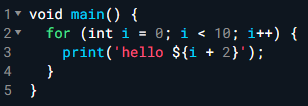
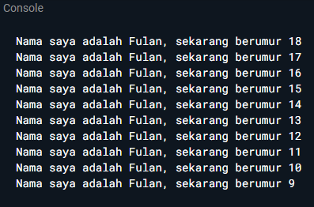
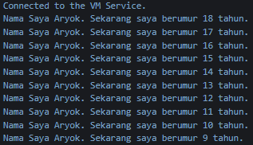

# Pertemaun 2 Mobile Development
## Aryo Adi Putro | TI-3G/07

### Soal 
1. Modifikasilah kode pada baris 3 di VS Code atau Editor Code favorit Anda berikut ini agar mendapatkan keluaran (output) sesuai yang diminta!  

- Output yang diminta (Gantilah Fulan dengan nama Anda):  

2. Mengapa sangat penting untuk memahami bahasa pemrograman Dart sebelum kita menggunakan framework Flutter ? Jelaskan!

3. Rangkumlah materi dari codelab ini menjadi poin-poin penting yang dapat Anda gunakan untuk membantu proses pengembangan aplikasi mobile menggunakan framework Flutter.

4. Buatlah penjelasan dan contoh eksekusi kode tentang perbedaan Null Safety dan Late variabel !

### Jawab 

1. void main() {
  for (var i = 10; i >= 1; i--) {
    print('Nama Saya Aryok. Sekarang saya berumur ${8 + i} tahun.');
  }
}

2. Hasil  

3. Rangkuman
- Cara kerja dart dapat dieksekusi dengan 2 cara : Dart Virtual Machine dan JavaScript compilation.
- Membutuhkan Runtime systems, Dart core libraries, dan Garbage collectors untuk mendukung bahasa dart.
- Dapat beroperasi dalam mode Just-In-Time(JIT) dan Ahead-Of-Time(AOT).
- Dart dirancang untuk OOP.
- Dalam dart operator tidak lebih dari method yang didefinisikan dalam class dengan sintaks khusus.

4. Penjelasan
- Null safety merupakan metode untuk mencegah error dengan memastikan variabel tidak bisa bernilai null kecuali dideklarasikan sebagai nullable. Contoh : String? nullableName;
- Late variable merupakan cara untuk menunda inisialisasi variabel non-nullable hingga benar-benar dibutuhkan. Contoh : late String fullName;