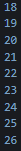

# Pertemuan 3

## Aryo Adi Putro | TI-3G/07

## Soal

1. Silakan selesaikan Praktikum 1 sampai 3, lalu dokumentasikan berupa screenshot hasil pekerjaan beserta penjelasannya!

#### Praktikum 1

##### Langkah 1

Ketik atau salin kode program berikut ke dalam fungsi main().

```dart
    String test = "test2";
    if (test == "test1") {
            print("Test1");
        } else If (test == "test2") {
            print("Test2");
        } Else {
            print("Something else");
    }

    if (test == "test2") print("Test2 again");
```
##### Langkah 2

Silakan coba eksekusi (Run) kode pada langkah 1 tersebut. Apa yang terjadi? Jelaskan!

- Kode tidak dapat dijalankan karena salah misstype dalam baris kode. Perlu diubah menjadi seperti di bawah ini agar kode dapar dijalankan.

``` dart
void main() {
  String test = "test2";
  if (test == "test1") {
    print("Test1");
  } else if (test == "test2") {
    print("Test2");
  } else {
    print("Something else");
  }

  if (test == "test2") print("Test2 again");
}
```

- Hasilnya


##### Langkah 3

Tambahkan kode program berikut, lalu coba eksekusi (Run) kode Anda.

``` dart
void main() {
  String test = "true";
  
  if (test) {
    print("Kebenaran");
  }
}
```

Apa yang terjadi ? Jika terjadi error, silakan perbaiki namun tetap menggunakan if/else.

- Sama seperti langkah pertama, kode tidak dapat dijalankan karena kesalahan penulisan logika. Berikut perbaikan agar kode dapat dijalankan.

``` dart
void main() {
  String test = "true";

  if (test == "true") {
    print("Kebenaran");
  }
}
```


#### Praktikum 2

##### Langkah 1

Ketik atau salin kode program berikut ke dalam fungsi main().

```dart
void main() {
    while (counter < 33) {
        print(counter);
        counter++;
    }
}
```

##### Langkah 2

Silakan coba eksekusi (Run) kode pada langkah 1 tersebut. Apa yang terjadi? Jelaskan! Lalu perbaiki jika terjadi error.

- Kode tidak dapat dijalankan karena 'counter' belum didefinisikan. Setelah didefinisikan akan menjadi seperti ini.

```dart
void main() {
  int counter = 0;
  while (counter < 33) {
    print(counter);
    counter++;
  }
}
```

Hasil


##### Langkah 3

Tambahkan kode program berikut, lalu coba eksekusi (Run) kode Anda.

```dart
  do {
    print(counter);
    counter++;
  } while (counter < 77);
```

Apa yang terjadi ? Jika terjadi error, silakan perbaiki namun tetap menggunakan do-while.

- Karena 'counter' telah didefinisikan sebelumnya, kode dapat dijalanakan dan hitungan akan terus berlanjut.


#### Praktikum 3

##### Langkah 1

Ketik atau salin kode program berikut ke dalam fungsi main().

```dart
void main() {
  for (Index = 10; index < 27; index) {
    print(Index);
  }
}
```

##### Langkah 2

Silakan coba eksekusi (Run) kode pada langkah 1 tersebut. Apa yang terjadi? Jelaskan! Lalu perbaiki jika terjadi error.

- Kode tidak dapat dijalankan karena misstype dan index belum didefinisikan. Setelah kode diperbaiki dan dijalankan, kode akan terus berjalan tanpa henti seperti dibawah ini.

```dart
void main() {
  int index;
  for (index = 10; index < 27; index) {
    print(index);
  }
}
```


Perlu diubah lagi untuk memberi batasan agar kode dapat berhenti sendiri yang mana seperti di bawah ini.

```dart
  for (index = 10; index < 27; index++) {
    print(index);
  }
```

Hasil



##### Langkah 3

Tambahkan kode program berikut di dalam for-loop, lalu coba eksekusi (Run) kode Anda.

```dart
If (Index == 21) break;
Else If (index > 1 || index < 7) continue;
print(index);
```

Apa yang terjadi ? Jika terjadi error, silakan perbaiki namun tetap menggunakan for dan break-continue.

- Kode tidak dapat berjalan karena kesalahan logika. break-continue hanya bisa digunkan dalam logika perulangan. Seperti di bawah ini.

```dart
  for (index = 10; index < 27; index++) {
    if (index == 21)
      break;
    else if (index > 1 && index < 7)
      continue;
    print(index);
  }
```

Hasil 


2. Buatlah sebuah program yang dapat menampilkan bilangan prima dari angka 0 sampai 201 menggunakan Dart. Ketika bilangan prima ditemukan, maka tampilkan nama lengkap dan NIM Anda.

Hasil


3. Kumpulkan berupa link commit repo GitHub pada tautan yang telah disediakan di grup Telegram!
