# Pertemuan 4

## Pengantar Bahasa Pemrograman Dart - Bagian 3

### Aryo Adi P. | TI-3G/07

#### Praktikum 1

##### Langkah 1

- Ketik atau salin kode program berikut ke dalam void main().

```dart
    var list = [1, 2, 3];
    assert(list.length == 3);
    assert(list[1] == 2);
    print(list.length);
    print(list[1]);

    list[1] = 1;
    assert(list[1] == 1);
    print(list[1]);
```

##### Langkah 2

> Silakan coba eksekusi (Run) kode pada langkah 1 tersebut. Apa yang terjadi? Jelaskan!

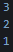

- Panjang list, nilai pada list[1] pertama, dan nilai pada list[1] akan ditamplikan saat kode dijalankan.

##### Langkah 3

> Ubah kode pada langkah 1 menjadi variabel final yang mempunyai index = 5 dengan default value = null. Isilah nama dan NIM Anda pada elemen index ke-1 dan ke-2. Lalu print dan capture hasilnya. Apa yang terjadi ? Jika terjadi error, silakan perbaiki.

- Kode dapat dijalankan, namun karena nilai variable dalam list bertipe null, hanya menampilkan null saat kode dijalankan. variable list perlu diubah agar kode bisa dijalankan.

```dart
  final list = {5};
  list[1] = "Aryo Adi Putro";
  list[2] = "2341720084";
  print(list[1]);
  print(list[2]);
```

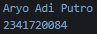

#### Praktikum 2

##### Langkah 1

> Ketik atau salin kode program berikut ke dalam fungsi main().

```dart
var halogens = {'fluorine', 'chlorine', 'bromine', 'iodine', 'astatine'};
print(halogens);
```

##### Langkah 2

> Silakan coba eksekusi (Run) kode pada langkah 1 tersebut. Apa yang terjadi? Jelaskan! Lalu perbaiki jika terjadi error.

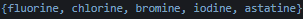

- Akan menampilkan nilai array dari variable halogens.

##### Langkah 3

> Tambahkan kode program berikut, lalu coba eksekusi (Run) kode Anda.

```dart
var names1 = <String>{};
Set<String> names2 = {}; // This works, too.
var names3 = {}; // Creates a map, not a set.

print(names1);
print(names2);
print(names3);
```

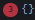

> Apa yang terjadi? Jika terjadi error, silakan perbaiki namun tetap menggunakan ketiga variabel tersebut. Tambahkan elemen nama dan NIM Anda pada kedua variabel Set tersebut dengan dua fungsi berbeda yaitu .add() dan .addAll(). Untuk variabel Map dihapus, nanti kita coba di praktikum selanjutnya.

- Variable names tidak menampilkan apapun karena belum diisi nilainya. Dan setelah dilakukan perubahan pada kode, variable names akan menampilkan nilai yang ada setelah diisi nilainya.

```dart
  var halogens = {'fluorine', 'chlorine', 'bromine', 'iodine', 'astatine'};
  print(halogens);

  var names1 = <String>{};
  Set<String> names2 = {};
  names1.add('Aryo Adi Putro');
  names2.addAll(['2341720084']);

  print(names1);
  print(names2);
```

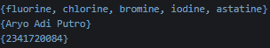

#### Praktikum 3

##### Langkah 1

> Ketik atau salin kode program berikut ke dalam fungsi main().

```dart
var gifts = {
  // Key:    Value
  'first': 'partridge',
  'second': 'turtledoves',
  'fifth': 1
};

var nobleGases = {
  2: 'helium',
  10: 'neon',
  18: 2,
};

print(gifts);
print(nobleGases);
```

##### Langkah 2

> Silakan coba eksekusi (Run) kode pada langkah 1 tersebut. Apa yang terjadi? Jelaskan! Lalu perbaiki jika terjadi error.

- Saat kode dijalankan, akan menampilkan nilai key dalam variable.

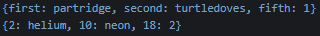

##### Langkah 3

> Tambahkan kode program berikut, lalu coba eksekusi (Run) kode Anda.

```dart
var mhs1 = Map<String, String>();
gifts['first'] = 'partridge';
gifts['second'] = 'turtledoves';
gifts['fifth'] = 'golden rings';

var mhs2 = Map<int, String>();
nobleGases[2] = 'helium';
nobleGases[10] = 'neon';
nobleGases[18] = 'argon';
```

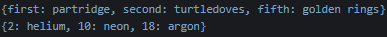

> Apa yang terjadi ? Jika terjadi error, silakan perbaiki. Tambahkan elemen nama dan NIM Anda pada tiap variabel di atas (gifts, nobleGases, mhs1, dan mhs2). Dokumentasikan hasilnya dan buat laporannya!

- Kode tetap dapat dijalankan dan hasilnya sama seperti yang ditampilkan pada langkah sebelumnya dengan sedikit perubahan pada nilai yang berupa angka diubah menjadi sebuah teks berbentuk String. Dan setelah dilakukan perubahan akan menjadi seperti ini.

```dart
  var gifts = {'first': 'partridge', 'second': 'turtledoves', 'fifth': 1};

  var nobleGases = {2: 'helium', 10: 'neon', 18: 2};

  var mhs1 = Map<String, String>();
  mhs1['nama'] = 'Aryo Adi Putro';
  mhs1['nim'] = '2341720084';

  gifts['first'] = 'partridge';
  gifts['second'] = 'turtledoves';
  gifts['fifth'] = 'golden rings';
  gifts['nama'] = 'Aryo Adi Putro';
  gifts['nim'] = '2341720084';

  var mhs2 = Map<int, String>();
  mhs2[0] = 'Aryo Adi Putro';
  mhs2[1] = '2341720084';

  nobleGases[2] = 'helium';
  nobleGases[10] = 'neon';
  nobleGases[18] = 'argon';
  nobleGases[26] = 'Aryo Adi Putro';
  nobleGases[34] = '2341720084';

  print(gifts);
  print(nobleGases);
```

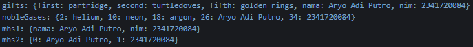

#### Praktikum 4

##### Langkah 1

> Ketik atau salin kode program berikut ke dalam fungsi main().

```dart
    var list = [1, 2, 3];
    var list2 = [0, ...list];
    print(list1);
    print(list2);
    print(list2.length);
```

##### Langkah 2

> Silakan coba eksekusi (Run) kode pada langkah 1 tersebut. Apa yang terjadi? Jelaskan! Lalu perbaiki jika terjadi error.

- Terjadi erorr karena misstype pada kode. Saat berhasil dijalankan akan menampilkan nilai dari variable list1 dan list2 dengan panjangnya.

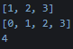

##### Langkah 3

> Tambahkan kode program berikut, lalu coba eksekusi (Run) kode Anda.

```dart
    list1 = [1, 2, null];
    print(list1);
    var list3 = [0, ...?list1];
    print(list3.length);
```

> Apa yang terjadi ? Jika terjadi error, silakan perbaiki. Tambahkan variabel list berisi NIM Anda menggunakan Spread Operators. Dokumentasikan hasilnya dan buat laporannya!

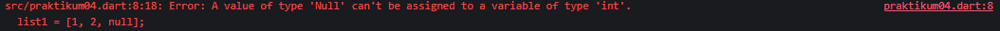

- Terjadi error karena terdapat kesalahan pengisian nilai tipe data int. Setelah diperbaiki akan menjadi seperti ini.

```dart
  var list1 = [1, 2, 3];
  var list2 = [0, ...list1];
  print(list1);
  print(list2);
  print(list2.length);

  list1 = [1, 2, 0, 2341720084];
  print(list1);
  var list3 = [0, ...list1];
  print(list3);
  print(list3.length);
```

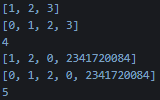

##### langkah 4

> Tambahkan kode program berikut, lalu coba eksekusi (Run) kode Anda.

```dart
  var nav = ['Home', 'Furniture', 'Plants', if (promoActive) 'Outlet'];
  print(nav);
```

> Apa yang terjadi ? Jika terjadi error, silakan perbaiki. Tunjukkan hasilnya jika variabel promoActive ketika true dan false.

- Terjadi error karena variable promoActive belum didefinisikan. Setelah diperbaiki akan menghasilkan output seperti berikut.

```dart
  bool promoActive = true;
  var nav = ['Home', 'Furniture', 'Plants', if (promoActive) 'Outlet'];
  print(nav);
```

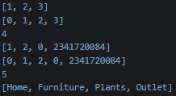

##### Langkah 5

> Tambahkan kode program berikut, lalu coba eksekusi (Run) kode Anda.

```dart
    var nav2 = ['Home', 'Furniture', 'Plants', if (login case 'Manager') 'Inventory'];
    print(nav2);
```

> Apa yang terjadi ? Jika terjadi error, silakan perbaiki. Tunjukkan hasilnya jika variabel login mempunyai kondisi lain.

- Terjadi error karena variable login belum didefinisikan. Setelah diperbaiki akan menghasilkan output seperti berikut.

```dart
  var login = 'Manager';
  var nav2 = [
    'Home',
    'Furniture',
    'Plants',
    if (login case 'Manager') 'Inventory',
  ];
  print(nav2);
```

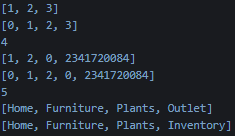

- Jika login diubah dengan kondisi lain, maka akan langsung dilewati.

```dart
  var login = 'Manager';
  var nav2 = [
    'Home',
    'Furniture',
    'Plants',
    // if (login case 'Manager') 'Inventory',
    if (login case 'Staff') 'Inventory',
  ];
  print(nav2);
```

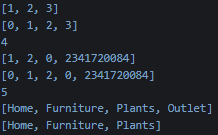

##### Langkah 6

> Tambahkan kode program berikut, lalu coba eksekusi (Run) kode Anda.

```dart
  var listOfInts = [1, 2, 3];
  var listOfStrings = ['#0', for (var i in listOfInts) '#$i'];
  assert(listOfStrings[1] == '#1');
  print(listOfStrings);
```

> Apa yang terjadi ? Jika terjadi error, silakan perbaiki. Jelaskan manfaat Collection For dan dokumentasikan hasilnya.

- Kode dapat dijalankan dan akan menampilkan nilai dari listOfStrings. Sedangkan fungsi collection for disini adalah untuk melakukan pengulangan sederhana yang akan menampilkan nilai dari variable.

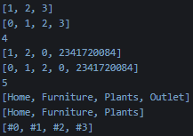

#### Praktikum 5

##### Langkah 1

> Ketik atau salin kode program berikut ke dalam fungsi main().

```dart
  var record = ('first', a: 2, b: true, 'last');
  print(record);
```

##### Langkah 2

> Silakan coba eksekusi (Run) kode pada langkah 1 tersebut. Apa yang terjadi? Jelaskan! Lalu perbaiki jika terjadi error.

- Kode dapat dijalankan dan menampilkan nilai dari variable yang dibuat.

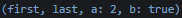

##### Langkah 3

> Tambahkan kode program berikut di luar scope void main(), lalu coba eksekusi (Run) kode Anda.

```dart
    (int, int) tukar((int, int) record) {
    var (a, b) = record;
    return (b, a);
    }
```

> Apa yang terjadi ? Jika terjadi error, silakan perbaiki. Gunakan fungsi tukar() di dalam main() sehingga tampak jelas proses pertukaran value field di dalam Records.

```dart
  var swap = tukar((10, 20));
  print(swap);
```

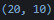

##### Langkah 4

> Tambahkan kode program berikut di dalam scope void main(), lalu coba eksekusi (Run) kode Anda.

```dart
  (String, int) mahasiswa;
  print(mahasiswa);
```

> Apa yang terjadi ? Jika terjadi error, silakan perbaiki. Inisialisasi field nama dan NIM Anda pada variabel record mahasiswa di atas. Dokumentasikan hasilnya dan buat laporannya!

```dart
  (String, int) mahasiswa = ('Aryo Adi Putro', 2341720084);
  print(mahasiswa);
```

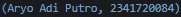

##### Langkah 5

> Tambahkan kode program berikut di dalam scope void main(), lalu coba eksekusi (Run) kode Anda.

```dart
  var mahasiswa2 = ('first', a: 2, b: true, 'last');

  print(mahasiswa2.$1); // Prints 'first'
  print(mahasiswa2.a); // Prints 2
  print(mahasiswa2.b); // Prints true
  print(mahasiswa2.$2); // Prints 'last'
```

> Apa yang terjadi ? Jika terjadi error, silakan perbaiki. Gantilah salah satu isi record dengan nama dan NIM Anda, lalu dokumentasikan hasilnya dan buat laporannya!

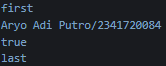

#### Tugas

1. Silakan selesaikan Praktikum 1 sampai 5, lalu dokumentasikan berupa screenshot hasil pekerjaan Anda beserta penjelasannya!
2. Jelaskan yang dimaksud Functions dalam bahasa Dart!

- Function merupakan baris kode yang reusable dalam Dart

3. Jelaskan jenis-jenis parameter di Functions beserta contoh sintaksnya!

- Positional yang mana parameter harus berurutan.

```dart
  void greet(String name, int age) {
    print('Hello $name, you are $age years old.');
  }

  void main() {
    greet('Alice', 25); // Output: Hello Alice, you are 25 years old.
  }
```

- Optional yang mana tidak harus diisi.

```dart
  void greet(String name, [int? age]) {
    if (age != null) {
      print('Hello $name, you are $age years old.');
    } else {
      print('Hello $name.');
    }
  }

  // Dengan nilai default
  void greetWithDefault(String name, [int age = 18]) {
    print('Hello $name, you are $age years old.');
  }

  void main() {
    greet('Bob'); // Output: Hello Bob.
    greet('Charlie', 30); // Output: Hello Charlie, you are 30 years old.
    greetWithDefault('Dave'); // Output: Hello Dave, you are 18 years old.
}
```

- Named yang mana pemanggilannya harus menggunakan namanya.

```dart
  void profile({required String name, int? age}) {
    print('Name: $name, Age: ${age ?? "unknown"}');
  }

  // Dengan nilai default
  void login({String username = 'guest', String? password}) {
    print('Logged in as $username');
  }

  void main() {
    profile(name: 'Eve'); // Output: Name: Eve, Age: unknown
    profile(name: 'Frank', age: 40); // Output: Name: Frank, Age: 40
    login(); // Output: Logged in as guest
    login(username: 'admin'); // Output: Logged in as admin
  }
```

4. Jelaskan maksud Functions sebagai first-class objects beserta contoh sintaknya!

- functions dapat diperlakukan seperti tipe data

```dart
  // 1. Menyimpan function di variabel
  void greet() => print('Hello!');
  var greeting = greet;
  greeting(); // Output: Hello!

  // 2. Melewatkan function sebagai argumen
  void executeFunction(void Function() fn) {
    fn();
  }

  executeFunction(greet); // Output: Hello!

  // 3. Mengembalikan function dari function
  Function multiply(int multiplier) {
    return (int value) => value * multiplier;
  }

  var doubleValue = multiply(2);
  print(doubleValue(5)); // Output: 10

  // 4. Menyimpan function dalam List
  var functions = [greet, doubleValue];
  functions[0](); // Output: Hello!
  print(functions[1](3)); // Output: 6
```

5. Apa itu Anonymous Functions? Jelaskan dan berikan contohnya!

- Merupakan functions tanpa nama yang digunakan untuk operasi singkat tanpa perlu didefinisikan secara terpisah.

```dart
  // 1. Anonymous function di variabel
  var add = (int a, int b) => a + b;
  print(add(2, 3)); // Output: 5

  // 2. Anonymous function sebagai argumen (contoh: List.forEach)
  void main() {
    var numbers = [1, 2, 3];
    numbers.forEach((num) => print(num * 2)); // Output: 2, 4, 6
  }

  // 3. Anonymous function dengan blok kode
  var calculate = (int a, int b) {
    int sum = a + b;
    int product = a * b;
    return 'Sum: $sum, Product: $product';
  };

  print(calculate(3, 4)); // Output: Sum: 7, Product: 12
```

6. Jelaskan perbedaan Lexical scope dan Lexical closures! Berikan contohnya!

- Lexical Scope : Aturan akses variabel berdasarkan posisi kode di mana variabel dideklarasikan. Inner function dapat mengakses variabel dari outer scope, tapi tidak sebaliknya

```dart
  void outerFunction() {
    var outerVar = 'I am outside';

    void innerFunction() {
      print(outerVar); // Bisa akses outerVar
    }

    innerFunction(); // Output: I am outside
  }

  void main() {
    outerFunction();
  }
```

- Lexical Closure : Function yang "mengingat" variabel dari lingkup di mana ia dibuat, meskipun lingkup tersebut sudah selesai. Anonymous functions sering menjadi closures

```dart
  Function makeCounter() {
    int count = 0; // Variabel di outer scope

    // Inner function yang menjadi closure
    return () {
      count++; // Mengakses dan mengubah variabel outer
      return count;
    };
  }

  void main() {
    var counter1 = makeCounter();
    print(counter1()); // Output: 1
    print(counter1()); // Output: 2

    var counter2 = makeCounter();
    print(counter2()); // Output: 1 (instance baru)
  }
```

7. Jelaskan dengan contoh cara membuat return multiple value di Functions!

- List/Array (untuk nilai sejenis)

```dart
  List<int> getCoordinates() {
    return [10, 20]; // Return x dan y
  }

  void main() {
    var coords = getCoordinates();
    print('x: ${coords[0]}, y: ${coords[1]}'); // Output: x: 10, y: 20
  }
```

- Map (untuk nilai dengan kunci)

```dart
  Map<String, dynamic> getUser() {
    return {'name': 'Alice', 'age': 25}; // Return name dan age
  }

  void main() {
    var user = getUser();
    print('Name: ${user['name']}, Age: ${user['age']}'); // Output: Name: Alice, Age: 25
  }
```

- Record (Dart 3.0+, untuk nilai dengan tipe berbeda)

```dart
  // Record dengan positional values
  (int, String) getProduct() {
    return (101, 'Laptop'); // Return ID dan nama produk
  }

  // Record dengan named fields
  ({int id, String name}) getProductNamed() {
    return (id: 102, name: 'Mouse');
  }

  void main() {
    var (id, name) = getProduct();
    print('ID: $id, Name: $name'); // Output: ID: 101, Name: Laptop

    var product = getProductNamed();
    print('ID: ${product.id}, Name: ${product.name}'); // Output: ID: 102, Name: Mouse
  }
```