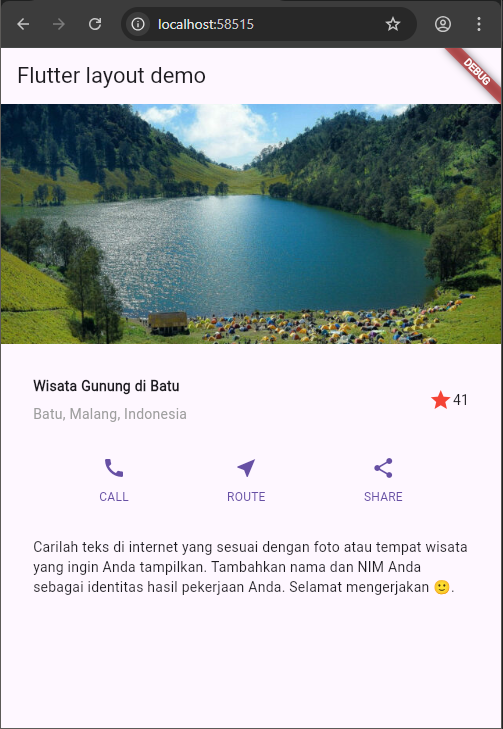

# Praktikum 6

## Aryo Adi Putro/2341720084

### Praktikum 1

```dart
import 'package:flutter/material.dart';

void main() => runApp(const MyApp());

class MyApp extends StatelessWidget {
  const MyApp({super.key});

  @override
  Widget build(BuildContext context) {
    final titleSection = Container(
      padding: const EdgeInsets.all(32),
      child: Row(
        children: [
          Expanded(
            child: Column(
              crossAxisAlignment: CrossAxisAlignment.start,
              children: [
                Container(
                  padding: const EdgeInsets.only(bottom: 8),
                  child: const Text(
                    'Wisata Gunung di Batu',
                    style: TextStyle(fontWeight: FontWeight.bold),
                  ),
                ),
                Text(
                  'Batu, Malang, Indonesia',
                  style: TextStyle(color: Colors.grey[500]),
                ),
              ],
            ),
          ),
          Icon(Icons.star, color: Colors.red[500]),
          const Text('41'),
        ],
      ),
    );

    return MaterialApp(
      title: 'Flutter layout Gwej: Aryo Adi Putro(2341720084)',
      home: Scaffold(
        appBar: AppBar(title: const Text('Flutter layout demo')),
        body: Column(children: [titleSection]),
      ),
    );
  }
}
```


1. Letakkan widget Column di dalam widget Expanded agar menyesuaikan ruang yang tersisa di dalam widget Row. Tambahkan properti crossAxisAlignment ke CrossAxisAlignment.start sehingga posisi kolom berada di awal baris.

```dart
Expanded(  // Requirement 1 starts here
  child: Column(
    crossAxisAlignment: CrossAxisAlignment.start,  // Part of requirement 1
    children: [
      // ...
    ],
  ),
),
```

2. Letakkan baris pertama teks di dalam Container sehingga memungkinkan Anda untuk menambahkan padding = 8. Teks ‘Batu, Malang, Indonesia' di dalam Column, set warna menjadi abu-abu.

```dart
Container(  // Requirement 2 starts here
  padding: const EdgeInsets.only(bottom: 8),  // Padding = 8
  child: const Text(
    'Wisata Gunung di Batu',
    style: TextStyle(fontWeight: FontWeight.bold),
  ),
),
Text(
  'Batu, Malang, Indonesia',
  style: TextStyle(color: Colors.grey[500]),  // Grey colored text
),
```

3. Dua item terakhir di baris judul adalah ikon bintang, set dengan warna merah, dan teks "41". Seluruh baris ada di dalam Container dan beri padding di sepanjang setiap tepinya sebesar 32 piksel. Kemudian ganti isi body text ‘Hello World' dengan variabel titleSection seperti berikut:

```dart
Container(  // Requirement 3 starts here
  padding: const EdgeInsets.all(32),  // 32 pixel padding on all sides
  child: Row(
    children: [
      // ...previous code...
      Icon(
        Icons.star,
        color: Colors.red[500],  // Red star icon
      ),
      const Text('41'),  // Rating text
    ],
  ),
),
```

### Praktikum 2

```dart
    Column _buildButtonColumn(Color color, IconData icon, String label) {
      return Column(
        mainAxisSize: MainAxisSize.min,
        mainAxisAlignment: MainAxisAlignment.center,
        children: [
          Icon(icon, color: color),
          Container(
            margin: const EdgeInsets.only(top: 8),
            child: Text(
              label,
              style: TextStyle(
                fontSize: 12,
                fontWeight: FontWeight.w400,
                color: color,
              ),
            ),
          ),
        ],
      );
    }

    // Get the primary color from theme
    Color color = Theme.of(context).primaryColor;

    // Create buttonSection widget
    final buttonSection = Row(
      mainAxisAlignment: MainAxisAlignment.spaceEvenly,
      children: [
        _buildButtonColumn(color, Icons.call, 'CALL'),
        _buildButtonColumn(color, Icons.near_me, 'ROUTE'),
        _buildButtonColumn(color, Icons.share, 'SHARE'),
      ],
    );

    return MaterialApp(
      title: 'Flutter layout Gwej: Aryo Adi Putro(2341720084)',
      home: Scaffold(
        appBar: AppBar(title: const Text('Flutter layout demo')),
        body: Column(
          children: [
            titleSection,
            buttonSection, // Add buttonSection here
          ],
        ),
      ),
    );
```


### Praktikum 3

```dart
    Widget textSection = Container(
      padding: const EdgeInsets.all(32),
      child: const Text(
        'Carilah teks di internet yang sesuai '
        'dengan foto atau tempat wisata yang ingin '
        'Anda tampilkan. '
        'Tambahkan nama dan NIM Anda sebagai '
        'identitas hasil pekerjaan Anda. '
        'Selamat mengerjakan 🙂.',
        softWrap: true,
      ),
    );

    return MaterialApp(
      title: 'Flutter layout Gwej: Aryo Adi Putro(2341720084)',
      home: Scaffold(
        appBar: AppBar(title: const Text('Flutter layout demo')),
        body: Column(
          children: [

            titleSection,
            buttonSection, // Add buttonSection here
            textSection,   // Add textSection here
          ],
        ),
      ),
    );
```


### praktikum 4

```dart
    return MaterialApp(
      title: 'Flutter layout Gwej: Aryo Adi Putro(2341720084)',
      home: Scaffold(
        appBar: AppBar(title: const Text('Flutter layout demo')),
        body: ListView(
          children: [
            Image.asset(
              '../layout_flutter/img/lake.jpg',
              width: 600,
              height: 240,
              fit: BoxFit.cover,
            ),

            titleSection,
            buttonSection, // Add buttonSection here
            textSection,   // Add textSection here
          ],
        ),
      ),
    );
```



### Tugas Praktikum 1

```dart
import 'package:flutter/material.dart';

void main() => runApp(const MyApp());

class MyApp extends StatelessWidget {
  const MyApp({super.key});

  @override
  Widget build(BuildContext context) {
    // Title section implementation
    final titleSection = Container(
      padding: const EdgeInsets.all(32),
      child: Row(
        children: [
          Expanded(
            child: Column(
              crossAxisAlignment: CrossAxisAlignment.start,
              children: [
                Container(
                  padding: const EdgeInsets.only(bottom: 8),
                  child: const Text(
                    'Wisata Gunung di Batu',
                    style: TextStyle(fontWeight: FontWeight.bold, fontSize: 20),
                  ),
                ),
                Text(
                  'Batu, Malang, Indonesia',
                  style: TextStyle(color: Colors.grey[500], fontSize: 16),
                ),
              ],
            ),
          ),
          Container(
            padding: const EdgeInsets.all(8),
            child: Row(
              children: [
                Icon(Icons.star, color: Colors.red[500]),
                const Text('41', style: TextStyle(fontSize: 16)),
              ],
            ),
          ),
        ],
      ),
    );

    // Button section implementation with proper spacing
    Column _buildButtonColumn(Color color, IconData icon, String label) {
      return Column(
        mainAxisSize: MainAxisSize.min,
        mainAxisAlignment: MainAxisAlignment.center,
        children: [
          Icon(icon, color: color, size: 30),
          Container(
            margin: const EdgeInsets.only(top: 8),
            child: Text(
              label,
              style: TextStyle(
                fontSize: 14,
                fontWeight: FontWeight.w400,
                color: color,
              ),
            ),
          ),
        ],
      );
    }

    final color = Theme.of(context).primaryColor;

    final buttonSection = Container(
      padding: const EdgeInsets.symmetric(vertical: 16),
      child: Row(
        mainAxisAlignment: MainAxisAlignment.spaceEvenly,
        children: [
          _buildButtonColumn(color, Icons.call, 'CALL'),
          _buildButtonColumn(color, Icons.near_me, 'ROUTE'),
          _buildButtonColumn(color, Icons.share, 'SHARE'),
        ],
      ),
    );

    // Text section with proper styling
    final textSection = Container(
      padding: const EdgeInsets.all(32),
      child: const Text(
        'Carilah teks di internet yang sesuai '
        'dengan foto atau tempat wisata yang ingin '
        'Anda tampilkan. '
        'Tambahkan nama dan NIM Anda sebagai '
        'identitas hasil pekerjaan Anda. '
        'Selamat mengerjakan 🙂.',
        softWrap: true,
        style: TextStyle(fontSize: 16, height: 1.5),
      ),
    );

    return MaterialApp(
      title: 'Flutter layout Gwej: Aryo Adi Putro(2341720084)',
      theme: ThemeData(
        primarySwatch: Colors.blue,
        visualDensity: VisualDensity.adaptivePlatformDensity,
      ),
      home: Scaffold(
        appBar: AppBar(title: const Text('Flutter layout demo')),
        body: ListView(
          children: [
            Image.asset(
              'layout_flutter/img/lake.jpg', // Make sure this path matches your asset declaration in pubspec.yaml
              width: 600,
              height: 240,
              fit: BoxFit.cover,
            ),
            titleSection,
            buttonSection,
            textSection,
          ],
        ),
      ),
    );
  }
}
```


### Praktikum 5


### Tugas Praktikum 2


