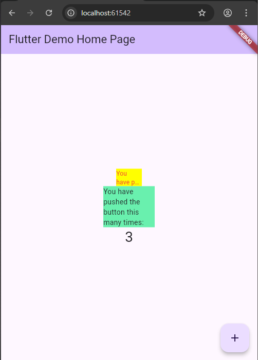

# Praktikum 7

## Aryo Adi Putro - 2341720084

### Praktikum

#### Langkah 2

```dart
flutter pub add auto_size_text
```

```dart
dependencies:
    auto_size_text: ^3.0.0
```

#### Langkah 3

```dart
import 'package:flutter/material.dart';

class RedTextWidget extends StatelessWidget {
  const RedTextWidget({Key? key}) : super(key: key);

  @override
  Widget build(BuildContext context) {
    return Container();
  }
}
```

#### Langkah 4

```dart
return AutoSizeText(
      text,
      style: const TextStyle(color: Colors.red, fontSize: 14),
      maxLines: 2,
      overflow: TextOverflow.ellipsis,
);
```

- Setelah Anda menambahkan kode di atas, Anda akan mendapatkan info error. Mengapa demikian? Jelaskan dalam laporan praktikum Anda!

- Saat ditambahkan kode diatas akan terjadi error karena di kode pada langkah 3, tidak melakukan import

```dart
flutter pub add auto_size_text
```

- Selain itu, belum melakukan deklarasi variable text dan juga perlu merubah

```dart
overflow: TextOverflow.ellipsis
```

menjadi

```dart
textAlign: TextAlign.center
```

#### Langkah 5

```dart
final String text;
const RedTextWidget({Key? key, required this.text}) : super(key: key);
```

#### Langkah 6

```dart
import 'package:flutter/material.dart';
import 'red_text_widget.dart';

void main() {
  runApp(const MyApp());
}

class MyApp extends StatelessWidget {
  const MyApp({super.key});

  @override
  Widget build(BuildContext context) {
    return MaterialApp(
      title: 'Flutter Demo',
      theme: ThemeData(
        colorScheme: ColorScheme.fromSeed(seedColor: Colors.deepPurple),
        useMaterial3: true,
      ),
      home: const MyHomePage(title: 'Flutter Demo Home Page'),
    );
  }
}

class MyHomePage extends StatefulWidget {
  const MyHomePage({super.key, required this.title});

  final String title;

  @override
  State<MyHomePage> createState() => _MyHomePageState();
}

class _MyHomePageState extends State<MyHomePage> {
  int _counter = 0;

  void _incrementCounter() {
    setState(() {
      _counter++;
    });
  }

  @override
  Widget build(BuildContext context) {
    return Scaffold(
      appBar: AppBar(
        backgroundColor: Theme.of(context).colorScheme.inversePrimary,
        title: Text(widget.title),
      ),
      body: Center(
        child: Column(
          mainAxisAlignment: MainAxisAlignment.center,
          children: <Widget>[
            Container(
              color: Colors.yellowAccent,
              width: 50,
              child: const RedTextWidget(
                text: 'You have pushed the button this many times:',
              ),
            ),
            Container(
              color: Colors.greenAccent,
              width: 50,
              child: const RedTextWidget(
                text: 'You have pushed the button this many times:',
              ),
            ),
            Text(
              '$_counter',
              style: Theme.of(context).textTheme.headlineMedium,
            ),
          ],
        ),
      ),
      floatingActionButton: FloatingActionButton(
        onPressed: _incrementCounter,
        tooltip: 'Increment',
        child: const Icon(Icons.add),
      ),
    );
  }
}
```




### Tugas Praktikum

1. Selesaikan Praktikum tersebut, lalu dokumentasikan dan push ke repository Anda berupa screenshot hasil pekerjaan beserta penjelasannya di file README.md!

2. Jelaskan maksud dari langkah 2 pada praktikum tersebut!

- Untuk mengimport package:auto_size_text/auto_size_text.dart dan memasukkan kedalam dependencies.

3. Jelaskan maksud dari langkah 5 pada praktikum tersebut!

- Mendeklarasikan variable baru dan menambahkannya ke dalam parameter.

4. Pada langkah 6 terdapat dua widget yang ditambahkan, jelaskan fungsi dan perbedaannya!

- Pada widget atas menambahkan text dengan background kuning, sedangkan widget bawah menambahkan text dengan background hijau dengan lebar yang berbeda.

5. Jelaskan maksud dari tiap parameter yang ada di dalam plugin auto_size_text berdasarkan tautan pada dokumentasi ini !

   > Parameter utama

- group: Parameter ini digunakan untuk menyinkronkan ukuran font dari beberapa AutoSizeText widget. Semua AutoSizeText yang berada dalam satu grup akan memiliki ukuran font yang sama, yang disesuaikan dengan anggota grup yang memiliki ukuran font efektif terkecil.

- stepGranularity: Menentukan seberapa besar penurunan ukuran font pada setiap langkah saat AutoSizeText mencoba menyesuaikan teks dengan ukurannya. Nilai ini biasanya tidak boleh di bawah 1 untuk performa terbaik.

- presetFontSizes: Jika Anda hanya ingin mengizinkan ukuran font tertentu, Anda dapat menentukannya dengan parameter ini. Jika presetFontSizes diatur, maka minFontSize, maxFontSize, dan stepGranularity akan diabaikan.

- overflowReplacement: Jika teks terlalu panjang dan tidak sesuai dengan batasnya, widget yang diatur di sini akan ditampilkan sebagai gantinya. Ini berguna untuk mencegah teks menjadi terlalu kecil untuk dibaca.

- minFontSize: Batasan ukuran teks minimum yang akan digunakan saat mengubah ukuran teks secara otomatis.

- maxFontSize: Batasan ukuran teks maksimum yang akan digunakan saat mengubah ukuran teks secara otomatis.

- maxLines: Jumlah baris maksimum opsional untuk teks, yang akan membungkus jika perlu. Jika teks melebihi jumlah baris yang diberikan, teks akan diubah ukurannya sesuai dengan batas yang ditentukan dan jika perlu dipotong sesuai dengan overflow.

- overflow: Mengatur bagaimana overflow visual harus ditangani. Misalnya, Anda bisa menggunakan TextOverflow.ellipsis untuk menampilkan elipsis (...) jika teks terlalu panjang.

  > Parameter text widget

- wrapWords: Menentukan apakah kata-kata yang tidak muat dalam satu baris harus dibungkus.

- style: TextStyle yang akan digunakan untuk teks.

- textAlign: Mengatur perataan teks secara horizontal.

- textDirection: Mengatur arah teks.

- textKey: Mengatur key untuk widget Text yang dihasilkan.

- textScaleFactor: Jumlah piksel font untuk setiap piksel logis.

- textSpan: Teks yang akan ditampilkan sebagai TextSpan.

6. Kumpulkan laporan praktikum Anda berupa link repository GitHub kepada dosen!
