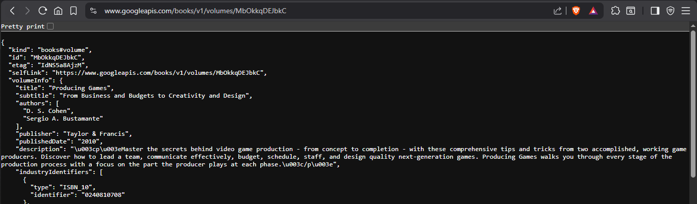
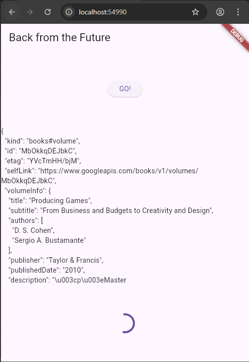
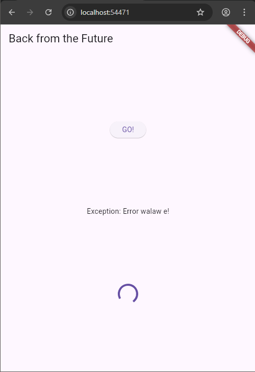
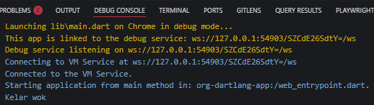
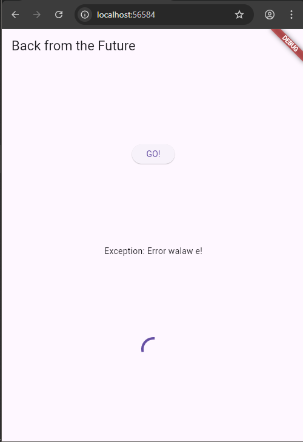
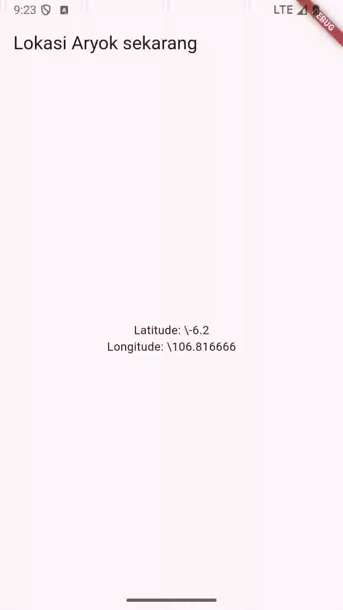

# Pertemuan 11

## Aryo Adi Putro - 2341720084 || TI-3G

### Praktikum 1

#### Langkah 1

- Buatlah sebuah project flutter baru dengan nama books di folder src week-11 repository GitHub Anda.

- Kemudian Tambahkan dependensi http dengan mengetik perintah berikut di terminal.

``` dart
flutter pub add http
```

#### Langkah 2

- Jika berhasil install plugin, pastikan plugin http telah ada di file pubspec ini seperti berikut.

``` dart
dependencies:
  flutter:
    sdk: flutter
  http: ^1.1.0
```

#### Langkah 3

- Ketiklah kode seperti berikut ini.

``` dart
import 'dart:async';
import 'package:flutter/material.dart';
import 'package:http/http.dart';
import 'package:http/http.dart' as http;

void main() {
  runApp(const MyApp());
}

class MyApp extends StatelessWidget {
  const MyApp({super.key});

  @override
  Widget build(BuildContext context) {
    return MaterialApp(
      title: 'Future Demo',
      theme: ThemeData(
        primarySwatch: Colors.blue,
        visualDensity: VisualDensity.adaptivePlatformDensity,
      ),
      home: const FuturePage(),
    );
  }
}

class FuturePage extends StatefulWidget {
  const FuturePage({super.key});

  @override
  State<FuturePage> createState() => _FuturePageState();
}

class _FuturePageState extends State<FuturePage> {
  String result = '';
  @override
  Widget build(BuildContext context) {
    return Scaffold(
      appBar: AppBar(
        title: const Text('Back from the Future'),
      ),
      body: Center(
        child: Column(children: [
          const Spacer(),
          ElevatedButton(
            child: const Text('GO!'),
            onPressed: () {},
          ),
          const Spacer(),
          Text(result),
          const Spacer(),
          const CircularProgressIndicator(),
          const Spacer(),
        ]),
      ),
    );
  }
}
```

#### Langkah 4

- Tambahkan method ini ke dalam class _FuturePageState yang berguna untuk mengambil data dari API Google Books.

``` dart
  Future<Response> getData() async {
    const authority = 'www.googleapis.com';
    const path = '/books/v1/volumes/MbOkkqDEJbkC';
    Uri url = Uri.https(authority, path);

    return http.get(url);
  }
```



#### Langkah 5

- Tambahkan kode pada onPressed di ElevatedButton seperti berikut.

``` dart
            ElevatedButton(child: const Text('GO!'), onPressed: () {
              setState(() {
                result = 'Loading...';
              });
              getData().then((value) {
                setState(() {
                  result = value.body.toString().substring(0, 450);
                  setState(() {});
                });
              }).catchError((error) {
                setState(() {
                  result = 'Error: $error';
                  setState(() {});
                });
              });
            }),
```

- Lakukan run aplikasi Flutter Anda. Anda akan melihat tampilan akhir seperti gambar berikut. Jika masih terdapat error, silakan diperbaiki hingga bisa running.



- Penjelasan

| Bagian kode                | Fungsi utama                                                                                              |
| -------------------------- | --------------------------------------------------------------------------------------------------------- |
| `substring(0, 450)`        | Membatasi teks hasil HTTP hanya 450 karakter pertama                                                      |
| `catchError((error){...})` | Menangani error dari proses asynchronous (`Future`) agar aplikasi tidak crash dan menampilkan pesan error |

### Praktikum 2

#### Langkah 1

- Tambahkan tiga method berisi kode seperti berikut di dalam class _FuturePageState.

``` dart
Future<int> returnOneAsync() async {
  await Future.delayed(const Duration(seconds: 3));
  return 1;
}

Future<int> returnTwoAsync() async {
  await Future.delayed(const Duration(seconds: 3));
  return 2;
}

Future<int> returnThreeAsync() async {
  await Future.delayed(const Duration(seconds: 3));
  return 3;
}
```

#### Langkah 2

- Lalu tambahkan lagi method ini di bawah ketiga method sebelumnya.

``` dart
  Future count () async {
    int total = 0;
    total = await returnOneAsync();
    total += await returnTwoAsync();
    total += await returnThreeAsync();

    setState(() {
      result = total.toString();
    });
  }
```

#### Langkah 3

- Lakukan comment kode sebelumnya, ubah isi kode onPressed() menjadi seperti berikut.

``` dart
onPressed: () {
    count();
```

#### Langkah 4

- Akhirnya, run atau tekan F5 jika aplikasi belum running. Maka Anda akan melihat seperti gambar berikut, hasil angka 6 akan tampil setelah delay 9 detik.


- Kode dari langkah 1 dan 2 diatas yaitu untuk menambah jumlah nilai dari total pada setiap delay 3 detik yang mana pada tiap delay memiliki nilai yang berbeda untuk ditambahkan pada total.

### Praktikum 3

#### Langkah 1

- Pastikan telah impor package async berikut.

``` dart
import 'package:async/async.dart';
```

#### Langkah 2

- Tambahkan variabel late dan method di class _FuturePageState seperti ini.

``` dart
late Completer completer;

Future getNumber() {
  completer = Completer<int>();
  calculate();
  return completer.future;
}

Future calculate() async {
  await Future.delayed(const Duration(seconds : 5));
  completer.complete(42);
}
```

#### Langkah 3

- Tambahkan kode berikut pada fungsi onPressed(). Kode sebelumnya bisa Anda comment.


``` dart
getNumber().then((value) {
    setState(() {
    result = value.toString();
    });
});
```

#### Langkah 4

- Terakhir, run atau tekan F5 untuk melihat hasilnya jika memang belum running. Bisa juga lakukan hot restart jika aplikasi sudah running. Maka hasilnya akan seperti gambar berikut ini. Setelah 5 detik, maka angka 42 akan tampil.


- Penjelasan

| Bagian                   | Fungsi                                            |
| ------------------------ | ------------------------------------------------- |
| `Completer<int>()`       | Membuat Future yang bisa diselesaikan manual      |
| `completer.future`       | Future yang akan dikembalikan dan bisa di-`await` |
| `completer.complete(42)` | Menandakan Future selesai dengan nilai 42         |
| `Future.delayed(...)`    | Menunda penyelesaian selama 5 detik               |

#### Langkah 5

- Gantilah isi code method calculate() seperti kode berikut, atau Anda dapat membuat calculate2()

``` dart
  calculate() async {
    try {
      await new Future.delayed(const Duration(seconds: 5));
      completer.complete(42);
    } catch (e) {
      completer.completeError(e);
    }
  }
```

#### Langkah 6

- Ganti menjadi kode seperti berikut.

``` dart
getNumber().then((value) {
  setState(() {
    result = value.toString();
  });
}).catchError((e) {
  result = 'An error occurred';
});
```

- Penjelasan

| Kode                         | Fungsi                                               |
| ---------------------------- | ---------------------------------------------------- |
| `.then((value){ ... })`      | Dijalankan saat Future selesai dengan sukses         |
| `.catchError((e){ ... })`    | Dijalankan saat Future gagal (ada error)             |
| `completer.complete(42)`     | Menyelesaikan Future dengan nilai 42                 |
| `completer.completeError(e)` | Menyelesaikan Future dengan status error             |
| `setState()`                 | Memperbarui tampilan UI Flutter setelah data berubah |

### Praktikum 4

#### Langkah 1

- Tambahkan method ini ke dalam class _FuturePageState

``` dart
  void returnFG() {
    FutureGroup<int> futureGroup = FutureGroup<int>();
    futureGroup.add(returnOneAsync());
    futureGroup.add(returnTwoAsync());
    futureGroup.add(returnThreeAsync());
    futureGroup.close();

    futureGroup.future.then((List<int> values) {
      int total = 0;
      for (var value in values) {
        total += value;
      }
      setState(() {
        result = total.toString();
      });
    });
  }
```

#### Langkah 2

- Anda bisa hapus atau comment kode sebelumnya, kemudian panggil method dari langkah 1 tersebut.

``` dart
returnFG();
```

#### Langkah 3

- Anda akan melihat hasilnya dalam 3 detik berupa angka 6 lebih cepat dibandingkan praktikum sebelumnya menunggu sampai 9 detik.


#### Langkah 4

- Anda dapat menggunakan FutureGroup dengan Future.wait seperti kode berikut.

``` dart
final futures = Future.wait<int>([
    returnOneAsync(),
    returnTwoAsync(),
    returnThreeAsync(),
]);
```

- Penjelasan 

| Aspek                          | `Future.wait()`              | `FutureGroup`                       |
| ------------------------------ | ---------------------------- | ----------------------------------- |
| **Sumber**                     | Built-in di Dart core        | Perlu `package:async`               |
| **Cara menambahkan Future**    | Sekaligus (dalam list)       | Satu per satu dengan `.add()`       |
| **Menambahkan setelah mulai?** | Tidak bisa                   | Bisa (sebelum `.close()`)           |
| **Menutup daftar Future**      | Otomatis                     | Manual dengan `.close()`            |
| **Error handling**             | Gagal jika satu Future error | Bisa ditangani manual               |
| **Cocok untuk**                | Future tetap dan diketahui   | Future dinamis yang muncul bertahap |

### Praktikum 5

#### Langkah 1

- Tambahkan method ini ke dalam class _FuturePageState

``` dart
  Future returnError() async {
    await Future.delayed(const Duration(seconds: 2));
    throw Exception('Error walaw e!');
  }
```

#### Langkah 2

- Ganti dengan kode berikut

``` dart
returnError()
    .then((value) {
        setState(() {
        result = 'Sukses: $value';
        });
    })
    .catchError((onError) {
        setState(() {
        result = onError.toString();
        });
    })
    .whenComplete(() => print('Kelar wok'));
```

#### Langkah 3

- Lakukan run dan klik tombol GO! maka akan menghasilkan seperti gambar berikut.






#### Langkah 4

- Tambahkan kode ini di dalam class _FutureStatePage

``` dart
  Future handleError() async {
    try {
      await returnError();
    } catch (e) {
      setState(() {
        result = e.toString();
      });
    } finally {
      print('Kelar wok');
    }
  }
```




- Penjelasan 

| Aspek                | `returnError()`               | `handleError()`                               |
| -------------------- | ----------------------------- | --------------------------------------------- |
| **Fungsi utama**     | Menimbulkan error             | Menangani error dari `returnError()`          |
| **Error handling**   | Tidak ada (`throw Exception`) | Ada (`try` / `catch` / `finally`)             |
| **Hasil Future**     | Future gagal (error)          | Future berhasil (karena error ditangani)      |
| **Dampak ke UI**     | Tidak mengubah UI             | Mengubah variabel `result` lewat `setState()` |
| **Output di konsol** | Tidak mencetak apa pun        | Selalu mencetak `"Kelar wok"` di akhir        |

### Praktikum 6

#### Langkah 1

- Tambahkan plugin geolocator dengan mengetik perintah berikut di terminal.

```dart
flutter pub add geolocator
```

#### langkah 2

- Jika Anda menargetkan untuk platform Android, maka tambahkan baris kode berikut di file android/app/src/main/androidmanifest.xml

```dart
<uses-permission android:name="android.permission.ACCESS_FINE_LOCATION"/>
<uses-permission android:name="android.permission.ACCESS_COARSE_LOCATION"/>
```

#### Langkah 3

- Tambahkan file geolocation.dart ini di folder lib project Anda.

#### Langkah 4

- Buat class LocationScreen di dalam file geolocation.dart

```dart
import 'package:geolocator/geolocator.dart';
import 'package:flutter/material.dart';

class LocationScreen extends StatefulWidget {
  const LocationScreen({super.key});

  @override
  State<LocationScreen> createState() => _LocationScreenState();
}

class _LocationScreenState extends State<LocationScreen> {
  String myPosition = '';

  void initState() {
    super.initState();
    getPosition().then((Position myPos) {
      myPosition = 'Lat: ${myPos.latitude.toString()} - Longitude: ${myPos.longitude.toString()}';
      setState(() {
        myPosition = myPosition;
      });
    });
  }

  @override
  Widget build(BuildContext context) {
    return Scaffold(
      appBar: AppBar(
        title: const Text('Lokasi Aryok sekarang'),
      ),
      body: Center(
        child: Text(myPosition),
      ),
    );
  }

  Future<Position> getPosition() async {
    await Geolocator.requestPermission();
    await Geolocator.isLocationServiceEnabled();
    Position? position = await Geolocator.getCurrentPosition();

    return position;
  }
}
```

#### Langkah 5

- Panggil screen baru tersebut di file main Anda seperti berikut.

```dart
home: LocationScreen(),
```

#### Langkah 7

- Run project Anda di device atau emulator (bukan browser), maka akan tampil seperti berikut ini.


- Pertanyaan 

- Apakah Anda mendapatkan koordinat GPS ketika run di browser? Mengapa demikian?

- Tidak, karena fungsi GPS memerlukan perangkat keras perangkat dan tidak tersedia di browser.



### Praktikum 7

#### Langkah 1

- Buka file geolocation.dart kemudian ganti isi method dengan kode ini.

```dart
    await Future.delayed(const Duration(seconds: 3));
```

#### Langkah 2

- Tambah variabel ini di class _LocationScreenState

```dart
  Future<Position>? position;
```

#### Langkah 3

- Tambah method ini dan set variabel position

```dart
void initState() {
  super.initState();
  position = getPosition();
}
```

#### Langkah 4

- Ketik kode berikut dan sesuaikan. Kode lama bisa Anda comment atau hapus.

```dart
  @override
  Widget build(BuildContext context) {
    return Scaffold(
      appBar: AppBar(title: const Text('Current Location')),
      body: Center(
        child: FutureBuilder<Position>(
          future: position,
          builder: (BuildContext context, AsyncSnapshot<Position> snapshot) {
            if (snapshot.connectionState == ConnectionState.waiting) {
              return const CircularProgressIndicator();
            } else if (snapshot.connectionState == ConnectionState.done) {
              return Text(snapshot.data.toString());
            } else {
              return const Text('');
            }
          },
        ),
      ),
    );
  }
}
```

- Pertanyaan: Apakah ada perbedaan UI dengan praktikum sebelumnya? Mengapa demikian?

- Tidak Karena yang diubah adalah cara loadingnya yang melakukan delay sebelum memunculkan lokasi.


#### Langkah 5

- Tambahkan kode berikut untuk menangani ketika terjadi error. Kemudian hot restart.

```dart
else if (snapshot.connectionState == ConnectionState.done) {
  if (snapshot.hasError) {
     return Text('Something terrible happened!');
  }
  return Text(snapshot.data.toString());
}
```

- Pertanyaan: Apakah ada perbedaan UI dengan langkah sebelumnya? Mengapa demikian?

- Tidak karena hanya merubah cara penanganan jika terjadi error


