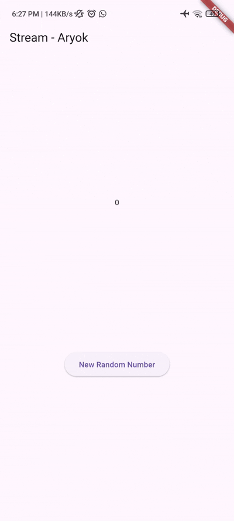

# Pertemuan 12

## Aryo Adi Putro - 2341720084 || TI-3G

### Praktikum 1: Dart Streams

#### Langkah 1: Buat Project Baru
- Buatlah sebuah project flutter baru dengan nama **stream_aryok** (beri nama panggilan Anda) di folder **week-12/src/** repository GitHub Anda.

#### Langkah 2: Buka file `main.dart`
- Ketiklah kode seperti berikut ini.

```dart
import 'package:flutter/material.dart';
import 'stream.dart';

void main() {
  runApp(const MyApp());
}

class MyApp extends StatelessWidget {
  const MyApp({super.key});

  @override
  Widget build(BuildContext context) {
    return MaterialApp(
      title: 'Stream - Aryok',
      theme: ThemeData(
        primarySwatch: Colors.deepPurple,
      ),
      home: const StreamHomePage(),
    );
  }
}

class StreamHomePage extends StatefulWidget {
  const StreamHomePage({super.key});

  @override
  State<StreamHomePage> createState() => _StreamHomePageState();
}

class _StreamHomePageState extends State<StreamHomePage> {
  @override
  Widget build(BuildContext context) {
    return Scaffold(
      appBar: AppBar(
        title: const Text('Stream - Aryok'),
      ),
      body: Container(),
    );
  }
}
```

##### Soal 1
- **Tambahkan nama panggilan Anda pada `title` app sebagai identitas hasil pekerjaan Anda.**
- **Gantilah warna tema aplikasi sesuai kesukaan Anda.**
- Sudah ditambahkan nama panggilan "Aryok" pada title app dan mengganti tema menjadi `Colors.deepPurple`

#### Langkah 3: Buat file baru `stream.dart`
- Buat file baru di folder lib project Anda. Lalu isi dengan kode berikut.

```dart
class ColorStream {
  
}
```

#### Langkah 4: Tambah variabel colors
- Tambahkan variabel di dalam class `ColorStream` seperti berikut.

```dart
import 'package:flutter/material.dart';

class ColorStream {
  final List<Color> colors = [
    Colors.blueGrey,
    Colors.amber,
    Colors.deepPurple,
    Colors.lightBlue,
    Colors.teal,
  ];
}
```

##### Soal 2
- **Tambahkan 5 warna lainnya sesuai keinginan Anda pada variabel `colors` tersebut.**
- Telah ditambahkan 5 warna lainnya: `Colors.pink`, `Colors.indigo`, `Colors.orange`, `Colors.cyan`, `Colors.lime`

```dart
final List<Color> colors = [
  Colors.blueGrey,
  Colors.amber,
  Colors.deepPurple,
  Colors.lightBlue,
  Colors.teal,
  Colors.pink,
  Colors.indigo,
  Colors.orange,
  Colors.cyan,
  Colors.lime,
];
```

#### Langkah 5: Tambah method `getColors()`
- Di dalam `class ColorStream` ketik method seperti kode berikut. Perhatikan tanda bintang di akhir keyword `async*` (ini digunakan untuk melakukan `Stream` data)

```dart
Stream<Color> getColors() async* {
  
}
```

#### Langkah 6: Tambah perintah `yield*`
- Tambahkan kode berikut ini.

```dart
yield* Stream.periodic(
  const Duration(seconds: 1), (int t) {
    int index = t % colors.length;
    return colors[index];
});
```

##### Soal 3
- **Jelaskan fungsi keyword `yield*` pada kode tersebut!**
  
  Keyword `yield*` digunakan untuk mengalirkan (stream) seluruh nilai dari Stream lain ke dalam Stream saat ini. Dalam kasus ini, `yield*` mengalirkan semua event dari `Stream.periodic` ke dalam Stream yang dikembalikan oleh method `getColors()`.

- **Apa maksud isi perintah kode tersebut?**
  
  Kode tersebut membuat Stream yang mengirimkan warna secara periodik setiap 1 detik. `Stream.periodic` menghasilkan event setiap detik dengan nilai integer `t` yang increment. Nilai `t` kemudian digunakan untuk menentukan index warna dengan operasi modulo `t % colors.length`, sehingga warna akan berputar secara berulang dari list colors.

#### Langkah 7: Buka `main.dart`
- Ketik kode impor file ini pada file `main.dart`

```dart
import 'stream.dart';
```

#### Langkah 8: Tambah variabel
- Ketik dua properti ini di dalam `class _StreamHomePageState`

```dart
Color bgColor = Colors.blueGrey;
late ColorStream colorStream;
```

#### Langkah 9: Tambah method `changeColor()`
- Tetap di file main, Ketik kode seperti berikut

```dart
void changeColor() async {
  await for (var eventColor in colorStream.getColors()) {
    setState(() {
      bgColor = eventColor;
    });
  }
}
```

#### Langkah 10: Lakukan override `initState()`
- Ketik kode seperti berikut

```dart
@override
void initState() {
  super.initState();
  colorStream = ColorStream();
  changeColor();
}
```

#### Langkah 11: Ubah isi `Scaffold()`
- Sesuaikan kode seperti berikut.

```dart
@override
Widget build(BuildContext context) {
  return Scaffold(
    appBar: AppBar(
      title: const Text('Stream - Aryok'),
    ),
    body: Container(
      decoration: BoxDecoration(color: bgColor),
    ),
  );
}
```

#### Langkah 12: Run
- Lakukan running pada aplikasi Flutter Anda, maka akan terlihat berubah warna background setiap detik.

##### Soal 4
- **Capture hasil praktikum Anda berupa GIF dan lampirkan di README.**


Aplikasi berhasil menampilkan perubahan warna background secara otomatis setiap 1 detik menggunakan Stream dengan metode `await for`.

#### Langkah 13: Ganti isi method `changeColor()`
- Anda boleh comment atau hapus kode sebelumnya, lalu ketik kode seperti berikut.

```dart
void changeColor() async {
  colorStream.getColors().listen((eventColor) {
    setState(() {
      bgColor = eventColor;
    });
  });
}
```

##### Soal 5
- **Jelaskan perbedaan menggunakan `listen` dan `await for` (langkah 9)!**

| Aspek | `listen` | `await for` |
|-------|----------|-------------|
| **Sifat** | Non-blocking, asynchronous | Blocking, sequential |
| **Eksekusi** | Kode setelahnya langsung dieksekusi | Menunggu stream selesai atau dibatalkan |
| **Kontrol** | Bisa dibatalkan dengan subscription.cancel() | Sulit dibatalkan, harus break dari loop |
| **Use Case** | Untuk stream yang berjalan terus (infinite) | Untuk stream dengan jumlah data terbatas |
| **Fleksibilitas** | Lebih fleksibel, bisa handle error, done, dan pause | Lebih sederhana tapi kurang kontrol |

Dalam praktikum ini, `listen` lebih cocok digunakan karena Stream yang dibuat adalah infinite stream (berjalan terus-menerus setiap detik). Dengan `listen`, kode tidak akan blocking dan stream akan berjalan di background sambil tetap bisa melakukan operasi lainnya.

---

### Praktikum 2: Stream controllers dan sinks

`StreamControllers` akan membuat jembatan antara `Stream` dan `Sink`. `Stream` berisi data secara sekuensial yang dapat diterima oleh subscriber manapun, sedangkan `Sink` digunakan untuk mengisi (injeksi) data.

#### Langkah 1: Buka file `stream.dart`
- Lakukan impor dengan mengetik kode ini.

```dart
import 'dart:async';
```

#### Langkah 2: Tambah class NumberStream
- Tetap di file `stream.dart` tambah class baru seperti berikut.

```dart
class NumberStream {
  
}
```

#### Langkah 3: Tambah StreamController
- Di dalam `class NumberStream` buatlah variabel seperti berikut.

```dart
final StreamController<int> controller = StreamController<int>();
```

#### Langkah 4: Tambah method addNumberToSink
- Tetap di `class NumberStream` buatlah method ini

```dart
void addNumberToSink(int newNumber) {
  controller.sink.add(newNumber);
}
```

#### Langkah 5: Tambah method close()
```dart
close() {
  controller.close();
}
```

#### Langkah 6: Buka main.dart
- Ketik kode import seperti berikut

```dart
import 'dart:async';
import 'dart:math';
```

#### Langkah 7: Tambah variabel
- Di dalam `class _StreamHomePageState` ketik variabel berikut

```dart
int lastNumber = 0;
late StreamController numberStreamController;
late NumberStream numberStream;
```

#### Langkah 8: Edit initState()
```dart
@override
void initState() {
  super.initState();
  numberStream = NumberStream();
  numberStreamController = numberStream.controller;
  Stream stream = numberStreamController.stream;
  stream.listen((event) {
    setState(() {
      lastNumber = event;
    });
  });
}
```

#### Langkah 9: Edit dispose()
```dart
@override
void dispose() {
  numberStreamController.close();
  super.dispose();
}
```

#### Langkah 10: Tambah method addRandomNumber()
```dart
void addRandomNumber() {
  Random random = Random();
  int myNum = random.nextInt(10);
  numberStream.addNumberToSink(myNum);
}
```

#### Langkah 11: Edit method build()
```dart
@override
Widget build(BuildContext context) {
  return Scaffold(
    appBar: AppBar(title: const Text('Stream - Aryok')),
    body: SizedBox(
      width: double.infinity,
      child: Column(
        mainAxisAlignment: MainAxisAlignment.spaceEvenly,
        crossAxisAlignment: CrossAxisAlignment.center,
        children: [
          Text(lastNumber.toString()),
          ElevatedButton(
            onPressed: () => addRandomNumber(),
            child: const Text('New Random Number'),
          ),
        ],
      ),
    ),
  );
}
```

#### Langkah 12: Run
- Lakukan running pada aplikasi Flutter Anda, maka akan terlihat seperti gambar berikut.

##### Soal 6
- **Jelaskan maksud kode langkah 8 dan 10 tersebut!**

**Langkah 8 - initState():**
```dart
numberStream = NumberStream();
numberStreamController = numberStream.controller;
Stream stream = numberStreamController.stream;
stream.listen((event) {
  setState(() {
    lastNumber = event;
  });
});
```
Kode ini menginisialisasi `NumberStream` dan `StreamController`. Kemudian membuat listener pada stream yang akan mendengarkan setiap event (angka) yang dikirim melalui stream. Setiap kali ada data baru, `setState()` dipanggil untuk memperbarui UI dengan nilai `lastNumber` yang terbaru.

**Langkah 10 - addRandomNumber():**
```dart
Random random = Random();
int myNum = random.nextInt(10);
numberStream.addNumberToSink(myNum);
```
Method ini membuat angka random dari 0-9 menggunakan `Random().nextInt(10)`, kemudian mengirimkan angka tersebut ke dalam stream melalui sink dengan `addNumberToSink()`. Angka ini kemudian akan diterima oleh listener di `initState()` dan ditampilkan di UI.

- **Capture hasil praktikum Anda berupa GIF dan lampirkan di README.**


#### Langkah 13: Buka stream.dart
- Tambahkan method berikut ini.

```dart
addError() {
  controller.sink.addError('error');
}
```

#### Langkah 14: Buka main.dart
- Tambahkan method `onError` di dalam `class StreamHomePageState` pada method `listen` di fungsi `initState()` seperti berikut ini.

```dart
stream.listen((event) {
  setState(() {
    lastNumber = event;
  });
}).onError((error) {
  setState(() {
    lastNumber = -1;
  });
});
```

#### Langkah 15: Edit method addRandomNumber()
- Lakukan comment pada dua baris kode berikut, lalu ketik kode seperti berikut ini.

```dart
void addRandomNumber() {
  Random random = Random();
  int myNum = random.nextInt(10);
  // numberStream.addNumberToSink(myNum);
  numberStream.addError();
}
```

##### Soal 7
- **Jelaskan maksud kode langkah 13 sampai 15 tersebut!**

**Langkah 13 - addError():**
Method ini menambahkan error ke dalam stream menggunakan `controller.sink.addError()`. Ini adalah cara untuk mensimulasikan atau mengirim error melalui stream.

**Langkah 14 - onError handler:**
Menambahkan error handler pada listener stream. Ketika stream menerima error (bukan data), maka blok `onError` akan dieksekusi dan mengubah `lastNumber` menjadi -1 sebagai indikator bahwa terjadi error.

**Langkah 15 - Edit addRandomNumber():**
Method diubah untuk mengirim error ke stream (dengan memanggil `addError()`) alih-alih mengirim angka random. Ini untuk mendemonstrasikan bagaimana error handling bekerja di stream. Ketika button ditekan, UI akan menampilkan -1 karena error.

**Penjelasan Flow:**
1. User menekan tombol
2. `addRandomNumber()` dipanggil
3. Method `addError()` mengirim error ke stream
4. Listener menangkap error melalui `onError()`
5. `setState()` mengubah `lastNumber` menjadi -1
6. UI menampilkan -1

- **Kembalikan kode seperti semula pada Langkah 15, comment `addError()` agar Anda dapat melanjutkan ke praktikum 3 berikutnya.**

```dart
void addRandomNumber() {
  Random random = Random();
  int myNum = random.nextInt(10);
  numberStream.addNumberToSink(myNum);
  // numberStream.addError();
}
```


---

### Praktikum 3: Injeksi data ke streams

Skenario yang umum dilakukan adalah melakukan manipulasi atau transformasi data stream sebelum sampai pada UI end user. Pada praktikum ini, kita akan menggunakan `StreamTransformers` untuk melakukan map dan filter data.

#### Langkah 1: Buka main.dart
- Tambahkan variabel baru di dalam `class _StreamHomePageState`

```dart
late StreamTransformer transformer;
```

#### Langkah 2: Tambahkan kode ini di initState
```dart
transformer = StreamTransformer<int, int>.fromHandlers(
  handleData: (value, sink) {
    sink.add(value * 10);
  },
  handleError: (error, trace, sink) {
    sink.add(-1);
  },
  handleDone: (sink) => sink.close(),
);
```

#### Langkah 3: Tetap di initState
- Lakukan edit seperti kode berikut.

```dart
stream.transform(transformer).listen((event) {
  setState(() {
    lastNumber = event;
  });
}).onError((error) {
  setState(() {
    lastNumber = -1;
  });
});
```

#### Langkah 4: Run
- Terakhir, run atau tekan F5 untuk melihat hasilnya jika memang belum running. Bisa juga lakukan hot restart jika aplikasi sudah running. Maka hasilnya akan seperti gambar berikut ini. Anda akan melihat tampilan angka dari 0 hingga 90.

##### Soal 8
- **Jelaskan maksud kode langkah 1-3 tersebut!**

**Langkah 1 - Deklarasi transformer:**
Mendeklarasikan variabel `transformer` bertipe `StreamTransformer` yang akan digunakan untuk mentransformasi data dalam stream sebelum sampai ke listener.

**Langkah 2 - Inisialisasi transformer:**
```dart
transformer = StreamTransformer<int, int>.fromHandlers(
  handleData: (value, sink) {
    sink.add(value * 10);
  },
  handleError: (error, trace, sink) {
    sink.add(-1);
  },
  handleDone: (sink) => sink.close(),
);
```

Membuat `StreamTransformer` dengan 3 handler:
- **handleData**: Mengalikan setiap nilai yang masuk dengan 10 sebelum dikirim ke sink. Jadi jika input 0-9, output menjadi 0-90.
- **handleError**: Menangani error dan mengubahnya menjadi nilai -1.
- **handleDone**: Menutup sink ketika stream selesai.

**Langkah 3 - Menggunakan transformer:**
```dart
stream.transform(transformer).listen(...)
```

Method `transform()` diterapkan pada stream untuk memodifikasi data menggunakan transformer yang sudah dibuat. Setiap angka random (0-9) akan dikalikan 10 sehingga menghasilkan 0, 10, 20, 30, ..., 90.

**Alur Kerja:**
1. Button ditekan → generate random number (0-9)
2. Angka masuk ke stream melalui sink
3. Transformer mengalikan angka dengan 10
4. Listener menerima hasil transformasi
5. UI menampilkan angka yang sudah ditransformasi (0-90)

- **Capture hasil praktikum Anda berupa GIF dan lampirkan di README.**



---
