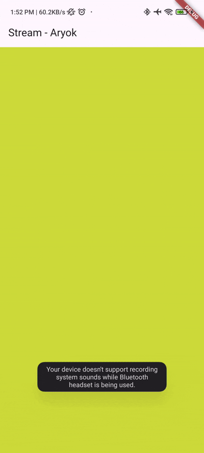
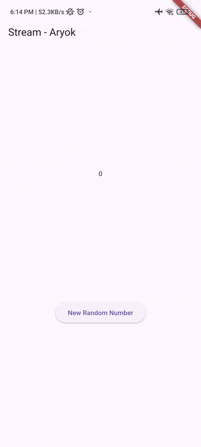
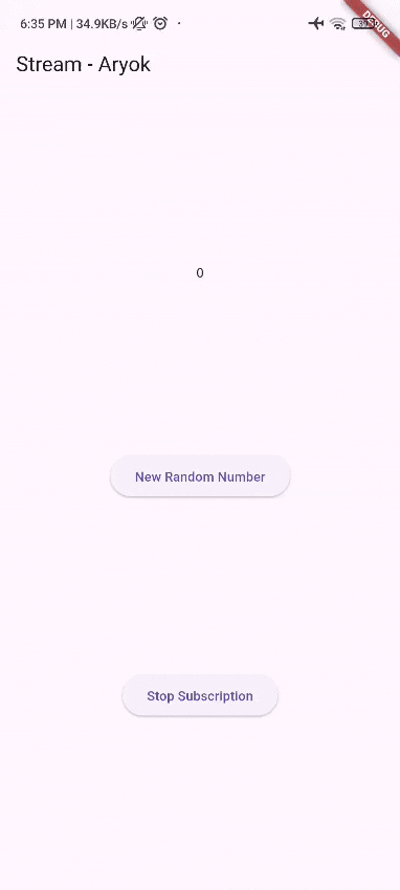

# Pertemuan 12

## Aryo Adi Putro - 2341720084 || TI-3G

### Praktikum 1: Dart Streams

#### Langkah 1: Buat Project Baru
- Buatlah sebuah project flutter baru dengan nama **stream_aryok** (beri nama panggilan Anda) di folder **week-12/src/** repository GitHub Anda.

#### Langkah 2: Buka file `main.dart`
- Ketiklah kode seperti berikut ini.

```dart
import 'package:flutter/material.dart';
import 'stream.dart';

void main() {
  runApp(const MyApp());
}

class MyApp extends StatelessWidget {
  const MyApp({super.key});

  @override
  Widget build(BuildContext context) {
    return MaterialApp(
      title: 'Stream - Aryok',
      theme: ThemeData(
        primarySwatch: Colors.deepPurple,
      ),
      home: const StreamHomePage(),
    );
  }
}

class StreamHomePage extends StatefulWidget {
  const StreamHomePage({super.key});

  @override
  State<StreamHomePage> createState() => _StreamHomePageState();
}

class _StreamHomePageState extends State<StreamHomePage> {
  @override
  Widget build(BuildContext context) {
    return Scaffold(
      appBar: AppBar(
        title: const Text('Stream - Aryok'),
      ),
      body: Container(),
    );
  }
}
```

##### Soal 1
- **Tambahkan nama panggilan Anda pada `title` app sebagai identitas hasil pekerjaan Anda.**
- **Gantilah warna tema aplikasi sesuai kesukaan Anda.**
- Sudah ditambahkan nama panggilan "Aryok" pada title app dan mengganti tema menjadi `Colors.deepPurple`

#### Langkah 3: Buat file baru `stream.dart`
- Buat file baru di folder lib project Anda. Lalu isi dengan kode berikut.

```dart
class ColorStream {
  
}
```

#### Langkah 4: Tambah variabel colors
- Tambahkan variabel di dalam class `ColorStream` seperti berikut.

```dart
import 'package:flutter/material.dart';

class ColorStream {
  final List<Color> colors = [
    Colors.blueGrey,
    Colors.amber,
    Colors.deepPurple,
    Colors.lightBlue,
    Colors.teal,
  ];
}
```

##### Soal 2
- **Tambahkan 5 warna lainnya sesuai keinginan Anda pada variabel `colors` tersebut.**
- Telah ditambahkan 5 warna lainnya: `Colors.pink`, `Colors.indigo`, `Colors.orange`, `Colors.cyan`, `Colors.lime`

```dart
final List<Color> colors = [
  Colors.blueGrey,
  Colors.amber,
  Colors.deepPurple,
  Colors.lightBlue,
  Colors.teal,
  Colors.pink,
  Colors.indigo,
  Colors.orange,
  Colors.cyan,
  Colors.lime,
];
```

#### Langkah 5: Tambah method `getColors()`
- Di dalam `class ColorStream` ketik method seperti kode berikut. Perhatikan tanda bintang di akhir keyword `async*` (ini digunakan untuk melakukan `Stream` data)

```dart
Stream<Color> getColors() async* {
  
}
```

#### Langkah 6: Tambah perintah `yield*`
- Tambahkan kode berikut ini.

```dart
yield* Stream.periodic(
  const Duration(seconds: 1), (int t) {
    int index = t % colors.length;
    return colors[index];
});
```

##### Soal 3
- **Jelaskan fungsi keyword `yield*` pada kode tersebut!**
  
  Keyword `yield*` digunakan untuk mengalirkan (stream) seluruh nilai dari Stream lain ke dalam Stream saat ini. Dalam kasus ini, `yield*` mengalirkan semua event dari `Stream.periodic` ke dalam Stream yang dikembalikan oleh method `getColors()`.

- **Apa maksud isi perintah kode tersebut?**
  
  Kode tersebut membuat Stream yang mengirimkan warna secara periodik setiap 1 detik. `Stream.periodic` menghasilkan event setiap detik dengan nilai integer `t` yang increment. Nilai `t` kemudian digunakan untuk menentukan index warna dengan operasi modulo `t % colors.length`, sehingga warna akan berputar secara berulang dari list colors.

#### Langkah 7: Buka `main.dart`
- Ketik kode impor file ini pada file `main.dart`

```dart
import 'stream.dart';
```

#### Langkah 8: Tambah variabel
- Ketik dua properti ini di dalam `class _StreamHomePageState`

```dart
Color bgColor = Colors.blueGrey;
late ColorStream colorStream;
```

#### Langkah 9: Tambah method `changeColor()`
- Tetap di file main, Ketik kode seperti berikut

```dart
void changeColor() async {
  await for (var eventColor in colorStream.getColors()) {
    setState(() {
      bgColor = eventColor;
    });
  }
}
```

#### Langkah 10: Lakukan override `initState()`
- Ketik kode seperti berikut

```dart
@override
void initState() {
  super.initState();
  colorStream = ColorStream();
  changeColor();
}
```

#### Langkah 11: Ubah isi `Scaffold()`
- Sesuaikan kode seperti berikut.

```dart
@override
Widget build(BuildContext context) {
  return Scaffold(
    appBar: AppBar(
      title: const Text('Stream - Aryok'),
    ),
    body: Container(
      decoration: BoxDecoration(color: bgColor),
    ),
  );
}
```

#### Langkah 12: Run
- Lakukan running pada aplikasi Flutter Anda, maka akan terlihat berubah warna background setiap detik.

##### Soal 4
- **Capture hasil praktikum Anda berupa GIF dan lampirkan di README.**



Aplikasi berhasil menampilkan perubahan warna background secara otomatis setiap 1 detik menggunakan Stream dengan metode `await for`.

#### Langkah 13: Ganti isi method `changeColor()`
- Anda boleh comment atau hapus kode sebelumnya, lalu ketik kode seperti berikut.

```dart
void changeColor() async {
  colorStream.getColors().listen((eventColor) {
    setState(() {
      bgColor = eventColor;
    });
  });
}
```

##### Soal 5
- **Jelaskan perbedaan menggunakan `listen` dan `await for` (langkah 9)!**

| Aspek | `listen` | `await for` |
|-------|----------|-------------|
| **Sifat** | Non-blocking, asynchronous | Blocking, sequential |
| **Eksekusi** | Kode setelahnya langsung dieksekusi | Menunggu stream selesai atau dibatalkan |
| **Kontrol** | Bisa dibatalkan dengan subscription.cancel() | Sulit dibatalkan, harus break dari loop |
| **Use Case** | Untuk stream yang berjalan terus (infinite) | Untuk stream dengan jumlah data terbatas |
| **Fleksibilitas** | Lebih fleksibel, bisa handle error, done, dan pause | Lebih sederhana tapi kurang kontrol |

Dalam praktikum ini, `listen` lebih cocok digunakan karena Stream yang dibuat adalah infinite stream (berjalan terus-menerus setiap detik). Dengan `listen`, kode tidak akan blocking dan stream akan berjalan di background sambil tetap bisa melakukan operasi lainnya.

---

### Praktikum 2: Stream controllers dan sinks

`StreamControllers` akan membuat jembatan antara `Stream` dan `Sink`. `Stream` berisi data secara sekuensial yang dapat diterima oleh subscriber manapun, sedangkan `Sink` digunakan untuk mengisi (injeksi) data.

#### Langkah 1: Buka file `stream.dart`
- Lakukan impor dengan mengetik kode ini.

```dart
import 'dart:async';
```

#### Langkah 2: Tambah class NumberStream
- Tetap di file `stream.dart` tambah class baru seperti berikut.

```dart
class NumberStream {
  
}
```

#### Langkah 3: Tambah StreamController
- Di dalam `class NumberStream` buatlah variabel seperti berikut.

```dart
final StreamController<int> controller = StreamController<int>();
```

#### Langkah 4: Tambah method addNumberToSink
- Tetap di `class NumberStream` buatlah method ini

```dart
void addNumberToSink(int newNumber) {
  controller.sink.add(newNumber);
}
```

#### Langkah 5: Tambah method close()
```dart
close() {
  controller.close();
}
```

#### Langkah 6: Buka main.dart
- Ketik kode import seperti berikut

```dart
import 'dart:async';
import 'dart:math';
```

#### Langkah 7: Tambah variabel
- Di dalam `class _StreamHomePageState` ketik variabel berikut

```dart
int lastNumber = 0;
late StreamController numberStreamController;
late NumberStream numberStream;
```

#### Langkah 8: Edit initState()
```dart
@override
void initState() {
  super.initState();
  numberStream = NumberStream();
  numberStreamController = numberStream.controller;
  Stream stream = numberStreamController.stream;
  stream.listen((event) {
    setState(() {
      lastNumber = event;
    });
  });
}
```

#### Langkah 9: Edit dispose()
```dart
@override
void dispose() {
  numberStreamController.close();
  super.dispose();
}
```

#### Langkah 10: Tambah method addRandomNumber()
```dart
void addRandomNumber() {
  Random random = Random();
  int myNum = random.nextInt(10);
  numberStream.addNumberToSink(myNum);
}
```

#### Langkah 11: Edit method build()
```dart
@override
Widget build(BuildContext context) {
  return Scaffold(
    appBar: AppBar(title: const Text('Stream - Aryok')),
    body: SizedBox(
      width: double.infinity,
      child: Column(
        mainAxisAlignment: MainAxisAlignment.spaceEvenly,
        crossAxisAlignment: CrossAxisAlignment.center,
        children: [
          Text(lastNumber.toString()),
          ElevatedButton(
            onPressed: () => addRandomNumber(),
            child: const Text('New Random Number'),
          ),
        ],
      ),
    ),
  );
}
```

#### Langkah 12: Run
- Lakukan running pada aplikasi Flutter Anda, maka akan terlihat seperti gambar berikut.

##### Soal 6
- **Jelaskan maksud kode langkah 8 dan 10 tersebut!**

**Langkah 8 - initState():**
```dart
numberStream = NumberStream();
numberStreamController = numberStream.controller;
Stream stream = numberStreamController.stream;
stream.listen((event) {
  setState(() {
    lastNumber = event;
  });
});
```
Kode ini menginisialisasi `NumberStream` dan `StreamController`. Kemudian membuat listener pada stream yang akan mendengarkan setiap event (angka) yang dikirim melalui stream. Setiap kali ada data baru, `setState()` dipanggil untuk memperbarui UI dengan nilai `lastNumber` yang terbaru.

**Langkah 10 - addRandomNumber():**
```dart
Random random = Random();
int myNum = random.nextInt(10);
numberStream.addNumberToSink(myNum);
```
Method ini membuat angka random dari 0-9 menggunakan `Random().nextInt(10)`, kemudian mengirimkan angka tersebut ke dalam stream melalui sink dengan `addNumberToSink()`. Angka ini kemudian akan diterima oleh listener di `initState()` dan ditampilkan di UI.

- **Capture hasil praktikum Anda berupa GIF dan lampirkan di README.**



#### Langkah 13: Buka stream.dart
- Tambahkan method berikut ini.

```dart
addError() {
  controller.sink.addError('error');
}
```

#### Langkah 14: Buka main.dart
- Tambahkan method `onError` di dalam `class StreamHomePageState` pada method `listen` di fungsi `initState()` seperti berikut ini.

```dart
stream.listen((event) {
  setState(() {
    lastNumber = event;
  });
}).onError((error) {
  setState(() {
    lastNumber = -1;
  });
});
```

#### Langkah 15: Edit method addRandomNumber()
- Lakukan comment pada dua baris kode berikut, lalu ketik kode seperti berikut ini.

```dart
void addRandomNumber() {
  Random random = Random();
  int myNum = random.nextInt(10);
  // numberStream.addNumberToSink(myNum);
  numberStream.addError();
}
```

##### Soal 7
- **Jelaskan maksud kode langkah 13 sampai 15 tersebut!**

**Langkah 13 - addError():**
Method ini menambahkan error ke dalam stream menggunakan `controller.sink.addError()`. Ini adalah cara untuk mensimulasikan atau mengirim error melalui stream.

**Langkah 14 - onError handler:**
Menambahkan error handler pada listener stream. Ketika stream menerima error (bukan data), maka blok `onError` akan dieksekusi dan mengubah `lastNumber` menjadi -1 sebagai indikator bahwa terjadi error.

**Langkah 15 - Edit addRandomNumber():**
Method diubah untuk mengirim error ke stream (dengan memanggil `addError()`) alih-alih mengirim angka random. Ini untuk mendemonstrasikan bagaimana error handling bekerja di stream. Ketika button ditekan, UI akan menampilkan -1 karena error.

**Penjelasan Flow:**
1. User menekan tombol
2. `addRandomNumber()` dipanggil
3. Method `addError()` mengirim error ke stream
4. Listener menangkap error melalui `onError()`
5. `setState()` mengubah `lastNumber` menjadi -1
6. UI menampilkan -1

- **Kembalikan kode seperti semula pada Langkah 15, comment `addError()` agar Anda dapat melanjutkan ke praktikum 3 berikutnya.**

```dart
void addRandomNumber() {
  Random random = Random();
  int myNum = random.nextInt(10);
  numberStream.addNumberToSink(myNum);
  // numberStream.addError();
}
```

### Praktikum 3: Injeksi data ke streams

Skenario yang umum dilakukan adalah melakukan manipulasi atau transformasi data stream sebelum sampai pada UI end user. Pada praktikum ini, kita akan menggunakan `StreamTransformers` untuk melakukan map dan filter data.

#### Langkah 1: Buka main.dart
- Tambahkan variabel baru di dalam `class _StreamHomePageState`

```dart
late StreamTransformer transformer;
```

#### Langkah 2: Tambahkan kode ini di initState
```dart
transformer = StreamTransformer<int, int>.fromHandlers(
  handleData: (value, sink) {
    sink.add(value * 10);
  },
  handleError: (error, trace, sink) {
    sink.add(-1);
  },
  handleDone: (sink) => sink.close(),
);
```

#### Langkah 3: Tetap di initState
- Lakukan edit seperti kode berikut.

```dart
stream.transform(transformer).listen((event) {
  setState(() {
    lastNumber = event;
  });
}).onError((error) {
  setState(() {
    lastNumber = -1;
  });
});
```

#### Langkah 4: Run
- Terakhir, run atau tekan F5 untuk melihat hasilnya jika memang belum running. Bisa juga lakukan hot restart jika aplikasi sudah running. Maka hasilnya akan seperti gambar berikut ini. Anda akan melihat tampilan angka dari 0 hingga 90.

##### Soal 8
- **Jelaskan maksud kode langkah 1-3 tersebut!**

**Langkah 1 - Deklarasi transformer:**
Mendeklarasikan variabel `transformer` bertipe `StreamTransformer` yang akan digunakan untuk mentransformasi data dalam stream sebelum sampai ke listener.

**Langkah 2 - Inisialisasi transformer:**
```dart
transformer = StreamTransformer<int, int>.fromHandlers(
  handleData: (value, sink) {
    sink.add(value * 10);
  },
  handleError: (error, trace, sink) {
    sink.add(-1);
  },
  handleDone: (sink) => sink.close(),
);
```

Membuat `StreamTransformer` dengan 3 handler:
- **handleData**: Mengalikan setiap nilai yang masuk dengan 10 sebelum dikirim ke sink. Jadi jika input 0-9, output menjadi 0-90.
- **handleError**: Menangani error dan mengubahnya menjadi nilai -1.
- **handleDone**: Menutup sink ketika stream selesai.

**Langkah 3 - Menggunakan transformer:**
```dart
stream.transform(transformer).listen(...)
```

Method `transform()` diterapkan pada stream untuk memodifikasi data menggunakan transformer yang sudah dibuat. Setiap angka random (0-9) akan dikalikan 10 sehingga menghasilkan 0, 10, 20, 30, ..., 90.

**Alur Kerja:**
1. Button ditekan → generate random number (0-9)
2. Angka masuk ke stream melalui sink
3. Transformer mengalikan angka dengan 10
4. Listener menerima hasil transformasi
5. UI menampilkan angka yang sudah ditransformasi (0-90)

- **Capture hasil praktikum Anda berupa GIF dan lampirkan di README.**


---

### Praktikum 4: Subscribe ke stream events

Dari praktikum sebelumnya, kita telah menggunakan method `listen` untuk mendapatkan nilai dari stream. Ini akan menghasilkan sebuah `Subscription`. `Subscription` berisi method yang dapat digunakan untuk melakukan `listen` pada suatu event dari stream secara terstruktur.

#### Langkah 1: Tambah variabel
- Tambahkan variabel berikut di `class _StreamHomePageState`

```dart
late StreamSubscription subscription;
```

#### Langkah 2: Edit initState()
- Edit kode seperti berikut ini.

```dart
subscription = stream.transform(transformer).listen(
  (event) {
    setState(() {
      lastNumber = event;
    });
  },
);
```

#### Langkah 3: Tetap di initState()
- Tambahkan kode berikut ini.

```dart
subscription = stream.transform(transformer).listen(
  (event) {
    setState(() {
      lastNumber = event;
    });
  },
  onError: (error) {
    setState(() {
      lastNumber = -1;
    });
  },
);
```

#### Langkah 4: Tambah properti onDone()
- Tambahkan dibawahnya kode ini setelah `onError`

```dart
subscription = stream.transform(transformer).listen(
  (event) {
    setState(() {
      lastNumber = event;
    });
  },
  onError: (error) {
    setState(() {
      lastNumber = -1;
    });
  },
  onDone: () {
    print('OnDone was called');
  },
);
```

#### Langkah 5: Tambah method baru
- Ketik method ini di dalam `class _StreamHomePageState`

```dart
void stopStream() {
  numberStreamController.close();
}
```

#### Langkah 6: Pindah ke method dispose()
- Jika method `dispose()` belum ada, Anda dapat mengetiknya dan dibuat override. Ketik kode ini didalamnya.

```dart
@override
void dispose() {
  subscription.cancel();
  numberStreamController.close();
  super.dispose();
}
```

#### Langkah 7: Pindah ke method build()
- Tambahkan button kedua dengan isi kode seperti berikut ini.

```dart
ElevatedButton(
  onPressed: () => stopStream(),
  child: const Text('Stop Subscription'),
),
```

#### Langkah 8: Edit method addRandomNumber()
- Edit kode seperti berikut ini.

```dart
void addRandomNumber() {
  Random random = Random();
  int myNum = random.nextInt(10);
  if (!numberStreamController.isClosed) {
    numberStream.addNumberToSink(myNum);
  } else {
    setState(() {
      lastNumber = -1;
    });
  }
}
```

#### Langkah 9: Run
- Anda akan melihat dua button seperti gambar berikut.

#### Langkah 10: Tekan button 'Stop Subscription'
- Anda akan melihat pesan di Debug Console seperti berikut: "OnDone was called"

##### Soal 9
- **Jelaskan maksud kode langkah 2, 6 dan 8 tersebut!**

**Langkah 2 - Edit initState():**
```dart
subscription = stream.transform(transformer).listen((event) {
  setState(() {
    lastNumber = event;
  });
});
```

Kode ini menyimpan hasil dari `.listen()` ke dalam variabel `subscription` bertipe `StreamSubscription`. Dengan menyimpan subscription, kita bisa mengontrol stream seperti membatalkan subscription, pause, atau resume. Ini adalah best practice untuk mengelola stream subscription dengan baik.

**Langkah 6 - dispose():**
```dart
@override
void dispose() {
  subscription.cancel();
  numberStreamController.close();
  super.dispose();
}
```

Method `dispose()` dipanggil ketika widget dihapus dari widget tree. Di sini kita:
1. `subscription.cancel()` - Membatalkan subscription untuk menghentikan listening ke stream dan mencegah memory leak
2. `numberStreamController.close()` - Menutup stream controller untuk membebaskan resource
3. `super.dispose()` - Memanggil dispose parent class

Ini penting untuk cleanup dan mencegah memory leak.

**Langkah 8 - Edit addRandomNumber():**
```dart
void addRandomNumber() {
  Random random = Random();
  int myNum = random.nextInt(10);
  if (!numberStreamController.isClosed) {
    numberStream.addNumberToSink(myNum);
  } else {
    setState(() {
      lastNumber = -1;
    });
  }
}
```

Kode ini menambahkan pengecekan apakah `numberStreamController` sudah ditutup atau belum dengan `!numberStreamController.isClosed`:
- Jika stream **belum ditutup**: kirim angka random ke stream
- Jika stream **sudah ditutup**: set `lastNumber` ke -1 sebagai indikator

Ini mencegah error saat mencoba mengirim data ke stream yang sudah ditutup.

**Alur Kerja Praktikum 4:**
1. User menekan "New Random Number" → angka muncul (0-90)
2. User menekan "Stop Subscription" → stream ditutup
3. `onDone()` dipanggil → print "OnDone was called"
4. User menekan "New Random Number" lagi → muncul -1 (karena stream sudah ditutup)



---

### Praktikum 5: Multiple stream subscriptions

Secara default, stream hanya bisa digunakan untuk satu subscription. Jika mencoba melakukan subscription yang sama lebih dari satu, maka akan terjadi error. Untuk menangani hal itu, tersedia broadcast stream yang dapat digunakan untuk multiple subscriptions.

#### Langkah 1: Buka file main.dart
- Ketik variabel berikut di `class _StreamHomePageState`

```dart
late StreamSubscription subscription2;
String values = '';
```

#### Langkah 2: Edit initState()
- Ketik kode seperti berikut.

```dart
subscription2 = stream.listen((event) {
  setState(() {
    values += '$event - ';
  });
});
```

#### Langkah 3: Run
- Lakukan run maka akan tampil error seperti berikut:

```
Bad state: Stream has already been listened to.
```

##### Soal 10
- **Jelaskan mengapa error itu bisa terjadi?**

Error ini terjadi karena secara default, `StreamController` membuat stream yang bersifat **single-subscription**. Artinya, stream tersebut hanya bisa di-listen oleh satu subscriber saja. Ketika kita mencoba menambahkan listener kedua (`subscription2`), stream sudah memiliki listener pertama (`subscription`), sehingga Dart melemparkan error `Bad state: Stream has already been listened to`.

**Penyebab:**
- `subscription` sudah listen ke `stream`
- `subscription2` mencoba listen ke `stream` yang sama
- Stream single-subscription tidak mengizinkan multiple listeners
- Error muncul karena pelanggaran aturan single-subscription

#### Langkah 4: Set broadcast stream
- Ketik kode seperti berikut di method `initState()`

```dart
Stream stream = numberStreamController.stream.asBroadcastStream();
```

#### Langkah 5: Edit method build()
- Tambahkan text seperti berikut

```dart
Text(values),
```

Tambahkan di dalam children Column setelah button "Stop Subscription".

#### Langkah 6: Run
- Tekan button 'New Random Number' beberapa kali, maka akan tampil teks angka terus bertambah sebanyak dua kali.

##### Soal 11
- **Jelaskan mengapa hal itu bisa terjadi?**

Hal ini terjadi karena kita telah mengubah stream menjadi **broadcast stream** menggunakan `asBroadcastStream()`. Broadcast stream memungkinkan multiple subscriptions pada stream yang sama.

**Yang terjadi:**
1. Button "New Random Number" ditekan → generate angka random (0-9)
2. Angka dikirim ke stream melalui sink
3. Stream meng-broadcast data ke semua subscriber

**Dua subscription yang aktif:**
- **subscription**: Menerima data yang sudah di-transform (dikali 10) → update `lastNumber` (0-90)
- **subscription2**: Menerima data asli (tanpa transform) → menambahkan ke `values` (0-9)

**Contoh:**
- Generate: 5
- subscription → transform: 5 × 10 = 50 → `lastNumber = 50`
- subscription2 → original: 5 → `values += '5 - '`

Jadi setiap kali button ditekan, `lastNumber` menampilkan hasil transformasi (0-90), sedangkan `values` menampilkan angka asli dalam bentuk string yang terakumulasi (0 - 5 - 3 - 7 - ...).

**Perbedaan Stream:**

| Aspek | Single-Subscription | Broadcast Stream |
|-------|---------------------|------------------|
| Jumlah Listener | Hanya 1 | Multiple (banyak) |
| Method | `stream` | `stream.asBroadcastStream()` |
| Use Case | Data sequence yang harus diproses sekali | Event yang perlu didengar banyak listener |
| Error jika > 1 listener | Ya | Tidak |

- **Capture hasil praktikum Anda berupa GIF dan lampirkan di README.**


---

### Praktikum 6: StreamBuilder

`StreamBuilder` adalah sebuah widget untuk melakukan listen terhadap event dari stream. Ketika sebuah event terkirim, maka akan dibangun ulang semua turunannya. `StreamBuilder` berguna untuk membangun UI secara reaktif yang diperbarui setiap data baru tersedia.

#### Langkah 1: Buat Project Baru
- Buatlah sebuah project flutter baru dengan nama **streambuilder_aryok** (beri nama panggilan Anda) di folder **week-12/src/** repository GitHub Anda.
- **Catatan:** Pada praktikum ini, kita akan menggunakan project yang sama dari praktikum sebelumnya, jadi tidak perlu membuat project baru.

#### Langkah 2: Buat file baru stream.dart
- Tetap gunakan file `stream.dart` yang sudah ada.

#### Langkah 3: Tetap di file stream.dart
- Tambahkan method `getNumbers()` di dalam class `NumberStream`.

```dart
Stream<int> getNumbers() async* {
  yield* Stream.periodic(const Duration(seconds: 1), (int t) {
    Random random = Random();
    int myNum = random.nextInt(10);
    return myNum;
  });
}
```

#### Langkah 4: Edit main.dart
- Buat class baru atau edit class yang sudah ada.

```dart
import 'package:flutter/material.dart';
import 'stream.dart';

void main() {
  runApp(const MyApp());
}

class MyApp extends StatelessWidget {
  const MyApp({super.key});

  @override
  Widget build(BuildContext context) {
    return MaterialApp(
      title: 'Stream - Aryok',
      theme: ThemeData(primarySwatch: Colors.deepPurple),
      home: const StreamHomePage(),
    );
  }
}

class StreamHomePage extends StatefulWidget {
  const StreamHomePage({super.key});

  @override
  State<StreamHomePage> createState() => _StreamHomePageState();
}
```

#### Langkah 5: Tambah variabel
- Di dalam `class _StreamHomePageState`, ketik variabel ini.

```dart
late Stream<int> numberStream;
```

#### Langkah 6: Edit initState()
- Ketik kode seperti berikut.

```dart
@override
void initState() {
  super.initState();
  numberStream = NumberStream().getNumbers();
}
```

#### Langkah 7: Edit method build()
```dart
@override
Widget build(BuildContext context) {
  return Scaffold(
    appBar: AppBar(title: const Text('Stream - Aryok')),
    body: StreamBuilder(
      stream: numberStream,
      initialData: 0,
      builder: (context, snapshot) {
        if (snapshot.hasError) {
          print('Error!');
        }
        if (snapshot.hasData) {
          return Center(
            child: Text(
              snapshot.data.toString(),
              style: const TextStyle(fontSize: 96),
            ),
          );
        } else {
          return const SizedBox.shrink();
        }
      },
    ),
  );
}
```

#### Langkah 8: Run
- Hasilnya, setiap detik akan tampil angka baru secara otomatis.

##### Soal 12
- **Jelaskan maksud kode pada langkah 3 dan 7!**

**Langkah 3 - Method getNumbers():**
```dart
Stream<int> getNumbers() async* {
  yield* Stream.periodic(const Duration(seconds: 1), (int t) {
    Random random = Random();
    int myNum = random.nextInt(10);
    return myNum;
  });
}
```

Method ini membuat stream yang secara otomatis menghasilkan (emit) angka random setiap 1 detik:
- `async*` menandakan ini adalah generator function yang menghasilkan stream
- `Stream.periodic` membuat stream yang emit data secara periodik (setiap 1 detik)
- Setiap detik, generate angka random 0-9 dengan `random.nextInt(10)`
- `yield*` mengalirkan semua nilai dari `Stream.periodic` ke stream yang dikembalikan
- Stream ini berjalan terus-menerus (infinite stream)

**Langkah 7 - StreamBuilder Widget:**
```dart
StreamBuilder(
  stream: numberStream,
  initialData: 0,
  builder: (context, snapshot) {
    if (snapshot.hasError) {
      print('Error!');
    }
    if (snapshot.hasData) {
      return Center(
        child: Text(
          snapshot.data.toString(),
          style: const TextStyle(fontSize: 96),
        ),
      );
    } else {
      return const SizedBox.shrink();
    }
  },
)
```

`StreamBuilder` adalah widget yang listen ke stream dan rebuild UI setiap kali ada data baru:
- **stream**: Sumber data stream (`numberStream`)
- **initialData**: Nilai awal sebelum stream emit data pertama (0)
- **builder**: Function yang dipanggil setiap ada event baru dari stream
- **snapshot**: Berisi state terkini dari stream (data, error, connection state)
  - `snapshot.hasError`: Cek apakah ada error
  - `snapshot.hasData`: Cek apakah ada data
  - `snapshot.data`: Data aktual dari stream

**Keuntungan StreamBuilder:**
1. **Otomatis manage subscription**: Tidak perlu manual listen dan cancel
2. **Rebuild otomatis**: UI update sendiri saat ada data baru
3. **Lifecycle aware**: Otomatis cleanup saat widget di-dispose
4. **Lebih simple**: Tidak perlu `setState()` manual

**Alur Kerja:**
1. `initState()` → create stream dari `getNumbers()`
2. Stream emit angka random setiap 1 detik
3. `StreamBuilder` listen ke stream
4. Setiap ada data baru → `builder` dipanggil
5. UI rebuild dengan angka baru
6. Proses berulang otomatis


---

### Praktikum 7: BLoC Pattern

BLoC (Business Logic Component) adalah pola arsitektur yang memisahkan logika bisnis dari UI. BLoC menerima stream data dari sumbernya, memproses sesuai logika bisnis, dan mengembalikan stream data ke subscriber.

**Konsep BLoC:**
- **Input**: Events (user actions) masuk melalui Sink
- **Process**: BLoC memproses events dengan business logic
- **Output**: Data keluar melalui Stream ke UI

#### Langkah 1: Buat Project baru
- Buatlah sebuah project flutter baru dengan nama **bloc_random_aryok** di folder **week-12/src/** repository GitHub Anda. 
- Buat file baru di folder `lib` dengan nama `random_bloc.dart`
- **Catatan:** Pada praktikum ini, kita tetap menggunakan project yang sama.

#### Langkah 2: Isi kode random_bloc.dart
- Ketik kode impor berikut ini.

```dart
import 'dart:async';
import 'dart:math';
```

#### Langkah 3: Buat class RandomNumberBloc()
```dart
class RandomNumberBloc {}
```

#### Langkah 4: Buat variabel StreamController
- Di dalam `class RandomNumberBloc()` ketik variabel berikut ini

```dart
// StreamController untuk input events
final _generateRandomController = StreamController<void>();
// StreamController untuk output data
final _randomNumberController = StreamController<int>();

// Sink untuk input (memasukkan event)
Sink<void> get generateRandom => _generateRandomController.sink;
// Stream untuk output (mengeluarkan data)
Stream<int> get randomNumber => _randomNumberController.stream;
```

#### Langkah 5: Buat constructor
```dart
RandomNumberBloc() {
  _generateRandomController.stream.listen((_) {
    final random = Random().nextInt(10);
    _randomNumberController.sink.add(random);
  });
}
```

#### Langkah 6: Buat method dispose()
```dart
void dispose() {
  _generateRandomController.close();
  _randomNumberController.close();
}
```

#### Langkah 7: Edit main.dart
```dart
import 'package:flutter/material.dart';
import 'random_screen.dart';

void main() {
  runApp(const MyApp());
}

class MyApp extends StatelessWidget {
  const MyApp({super.key});

  @override
  Widget build(BuildContext context) {
    return MaterialApp(
      title: 'Stream - Aryok',
      theme: ThemeData(primarySwatch: Colors.deepPurple),
      home: const RandomScreen(),
    );
  }
}
```

#### Langkah 8: Buat file baru random_screen.dart
- Di dalam folder `lib` project Anda, buatlah file baru ini.

#### Langkah 9: Lakukan impor material dan random_bloc.dart
- Ketik kode ini di file baru `random_screen.dart`

```dart
import 'package:flutter/material.dart';
import 'random_bloc.dart';
```

#### Langkah 10: Buat StatefulWidget RandomScreen
```dart
class RandomScreen extends StatefulWidget {
  const RandomScreen({super.key});

  @override
  State<RandomScreen> createState() => _RandomScreenState();
}
```

#### Langkah 11: Buat variabel
- Ketik kode ini di dalam `class _RandomScreenState`

```dart
final _bloc = RandomNumberBloc();
```

#### Langkah 12: Buat method dispose()
```dart
@override
void dispose() {
  _bloc.dispose();
  super.dispose();
}
```

#### Langkah 13: Edit method build()
```dart
@override
Widget build(BuildContext context) {
  return Scaffold(
    appBar: AppBar(title: const Text('Random Number - Aryok')),
    body: Center(
      child: StreamBuilder<int>(
        stream: _bloc.randomNumber,
        initialData: 0,
        builder: (context, snapshot) {
          return Text(
            'Random Number: ${snapshot.data}',
            style: const TextStyle(fontSize: 24),
          );
        },
      ),
    ),
    floatingActionButton: FloatingActionButton(
      onPressed: () => _bloc.generateRandom.add(null),
      child: const Icon(Icons.refresh),
    ),
  );
}
```

##### Soal 13
- **Jelaskan maksud praktikum ini! Dimanakah letak konsep pola BLoC-nya?**

**Maksud Praktikum:**
Praktikum ini mengimplementasikan pola BLoC (Business Logic Component) untuk memisahkan logika bisnis dari UI. Aplikasi menampilkan angka random (0-9) yang di-generate setiap kali user menekan FloatingActionButton.

**Letak Konsep Pola BLoC:**

**1. Separation of Concerns (Pemisahan Tanggung Jawab):**
- **random_bloc.dart**: Berisi semua logika bisnis (generate random number)
- **random_screen.dart**: Hanya menampilkan UI, tidak ada logika bisnis

**2. Stream-based Communication:**

**Input Stream (Events):**
```dart
final _generateRandomController = StreamController<void>();
Sink<void> get generateRandom => _generateRandomController.sink;
```
- User action (tap button) → masuk ke Sink
- Sink adalah "pintu masuk" untuk events

**Business Logic (Processing):**
```dart
RandomNumberBloc() {
  _generateRandomController.stream.listen((_) {
    final random = Random().nextInt(10);
    _randomNumberController.sink.add(random);
  });
}
```
- Listen ke input stream
- Proses: generate random number
- Kirim hasil ke output stream

**Output Stream (Data):**
```dart
final _randomNumberController = StreamController<int>();
Stream<int> get randomNumber => _randomNumberController.stream;
```
- Stream adalah "pintu keluar" untuk data
- UI listen ke stream ini via StreamBuilder

**3. Alur BLoC Pattern:**
```
User Tap Button 
    → Event masuk ke Sink (_bloc.generateRandom.add(null))
    → BLoC listen event dari input stream
    → BLoC proses (generate random number)
    → BLoC kirim hasil ke output stream via Sink
    → StreamBuilder listen output stream
    → UI rebuild dengan data baru
```

**4. Keuntungan BLoC:**
- ✅ **Testable**: Logic terpisah, mudah di-test tanpa UI
- ✅ **Reusable**: BLoC bisa dipakai di multiple screens
- ✅ **Maintainable**: Perubahan logic tidak affect UI
- ✅ **Scalable**: Mudah dikembangkan untuk app kompleks

**Perbedaan dengan Praktikum Sebelumnya:**

| Aspek | Praktikum 6 (StreamBuilder) | Praktikum 7 (BLoC) |
|-------|----------------------------|-------------------|
| Logic Location | Di dalam Widget State | Terpisah di BLoC class |
| Stream Creation | Langsung dari NumberStream | Melalui BLoC (input/output) |
| User Interaction | Tidak ada | Ada (button trigger event) |
| Pattern | Simple reactive UI | Full BLoC architecture |


---
