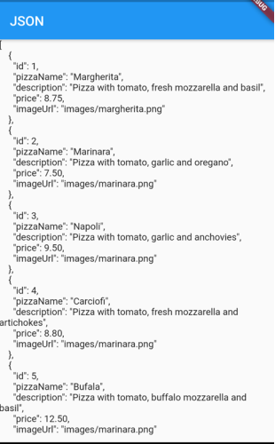
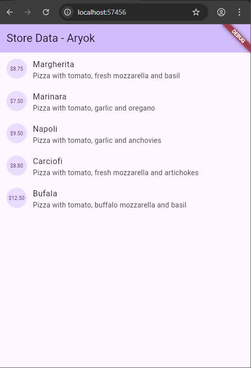
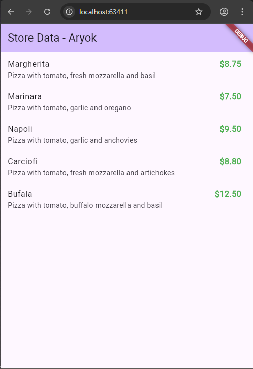

# Pertemuan 13

## Aryo Adi Putro - 2341720084 || TI-3G

---

### Praktikum 1: Konversi Dart model ke JSON

Praktikum ini bertujuan untuk mempelajari cara membaca file JSON dari assets, mengonversi data JSON menjadi objek Dart, dan melakukan serialization/deserialization.

#### Langkah 1: Buat Project Baru

Buatlah sebuah project flutter baru dengan nama `store_data_aryok` (beri nama panggilan Anda) di folder `week-13/src/` repository GitHub Anda.

#### Langkah 2: Buka file `main.dart`

Ketiklah kode seperti berikut ini.

```dart
import 'package:flutter/material.dart';

void main() {
  runApp(const MyApp());
}

class MyApp extends StatelessWidget {
  const MyApp({super.key});

  @override
  Widget build(BuildContext context) {
    return MaterialApp(
      title: 'Store Data - Aryok',
      theme: ThemeData(
        colorScheme: ColorScheme.fromSeed(seedColor: Colors.deepPurple),
      ),
      home: const MyHomePage(title: 'Store Data - Aryok'),
    );
  }
}

class MyHomePage extends StatefulWidget {
  const MyHomePage({super.key, required this.title});

  final String title;

  @override
  State<MyHomePage> createState() => _MyHomePageState();
}

class _MyHomePageState extends State<MyHomePage> {
  @override
  Widget build(BuildContext context) {
    return Scaffold(
      appBar: AppBar(
        backgroundColor: Theme.of(context).colorScheme.inversePrimary,
        title: Text(widget.title),
      ),
      body: Container(),
    );
  }
}
```

##### Soal 1

- Tambahkan nama panggilan Anda pada `title` app sebagai identitas hasil pekerjaan Anda.
- Gantilah warna tema aplikasi sesuai kesukaan Anda.
- Lakukan commit hasil jawaban Soal 1 dengan pesan "W13: Jawaban Soal 1"

**Jawaban:**

Sudah ditambahkan nama panggilan "Aryok" pada title app dan mengganti tema menjadi `Colors.deepPurple`.

```dart
title: 'Store Data - Aryok',
theme: ThemeData(
  colorScheme: ColorScheme.fromSeed(seedColor: Colors.deepPurple),
),
```

#### Langkah 3: Buat folder baru `assets`

Buat folder baru `assets` di root project Anda.

#### Langkah 4: Buat file baru `pizzalist.json`

Letakkan file ini di dalam folder `assets`, lalu salin data JSON berikut ke file tersebut.

```json
[ 
    { 
      "id": 1, 
      "pizzaName": "Margherita", 
      "description": "Pizza with tomato, fresh mozzarella and basil",
      "price": 8.75, 
      "imageUrl": "images/margherita.png" 
    }, 
    { 
      "id": 2, 
      "pizzaName": "Marinara", 
      "description": "Pizza with tomato, garlic and oregano",
      "price": 7.50, 
      "imageUrl": "images/marinara.png"  
    }, 
    { 
      "id": 3, 
      "pizzaName": "Napoli", 
      "description": "Pizza with tomato, garlic and anchovies",
      "price": 9.50, 
      "imageUrl": "images/marinara.png"  
    }, 
    { 
      "id": 4, 
      "pizzaName": "Carciofi", 
      "description": "Pizza with tomato, fresh mozzarella and artichokes",
      "price": 8.80, 
      "imageUrl": "images/marinara.png"  
    }, 
    { 
      "id": 5, 
      "pizzaName": "Bufala", 
      "description": "Pizza with tomato, buffalo mozzarella and basil",
      "price": 12.50, 
      "imageUrl": "images/marinara.png"  
    }
]
```

#### Langkah 5: Edit `pubspec.yaml`

Tambahkan referensi folder `assets` ke file pubspec.yaml seperti berikut ini.

```yaml
flutter:
  uses-material-design: true
  
  assets:
    - assets/pizzalist.json
```

#### Langkah 6: Edit `main.dart`

Buatlah variabel seperti berikut ini di class `_MyHomePageState`.

```dart
String pizzaString = '';
```

#### Langkah 7: Tetap di `main.dart`

Untuk membaca isi dari file `pizzalist.json` di dalam class `_MyHomePageState`, tambahkan method `readJsonFile` seperti kode berikut untuk membaca file json.

```dart
Future<void> readJsonFile() async {
  final String myString = await rootBundle.loadString('assets/pizzalist.json');
  setState(() {
    pizzaString = myString;
  });
}
```

#### Langkah 8: Panggil method readJsonFile

Panggil method `readJsonFile` di initState

```dart
@override
void initState() {
  super.initState();
  readJsonFile();
}
```

#### Langkah 9: Tampilkan hasil JSON

Kemudian tampilkan hasil JSON di body scaffold.

```dart
body: Center(
  child: Text(pizzaString),
),
```

#### Langkah 10: Run

Jika kode sudah benar, seharusnya tampil seperti gambar berikut ini.



##### Soal 2

- Masukkan hasil capture layar ke laporan praktikum Anda.
- Lakukan commit hasil jawaban Soal 2 dengan pesan "W13: Jawaban Soal 2"

**Jawaban:**

Aplikasi berhasil menampilkan data JSON dalam bentuk String.

#### Langkah 11: Buat file baru `pizza.dart`

Kita ingin mengubah data json tersebut dari String menjadi objek List. Maka perlu membuat file class baru di folder `lib/model` dengan nama file `pizza.dart`.

#### Langkah 12: Model pizza.dart

Ketik kode berikut pada file `pizza.dart`

```dart
class Pizza {
  final int id;
  final String pizzaName;
  final String description;
  final double price;
  final String imageUrl;

  Pizza({
    required this.id,
    required this.pizzaName,
    required this.description,
    required this.price,
    required this.imageUrl,
  });
}
```

#### Langkah 13: Buat `constructor()`

Di dalam class `Pizza` definisikan constructor `fromJson`, yang mana akan mengambil data berupa Map sebagai parameter dan mengubah Map ke objek Pizza seperti kode berikut:

```dart
// Factory constructor untuk konversi dari JSON (deserialization)
factory Pizza.fromJson(Map<String, dynamic> json) {
  return Pizza(
    id: json['id'],
    pizzaName: json['pizzaName'],
    description: json['description'],
    price: json['price'],
    imageUrl: json['imageUrl'],
  );
}
```

#### Langkah 14: Pindah ke `class _MyHomePageState`

Tambahkan kode jsonDecode seperti berikut.

```dart
Future<List<Pizza>> readJsonFile() async {
  final String myString = await rootBundle.loadString('assets/pizzalist.json');
  final List pizzaMapList = jsonDecode(myString);
  // ... lanjut ke langkah berikutnya
}
```

#### Langkah 15: Pastikan impor class

Perhatikan pada bagian atas file bahwa telah berhasil impor kedua file berikut.

```dart
import 'dart:convert';
import 'model/pizza.dart';
```

#### Langkah 16: Konversi List Map ke List Objek Dart

Di dalam method readJsonFile(), setelah baris `List pizzaMapList = jsonDecode(myString);`, tambahkan kode berikut untuk mengonversi setiap Map di pizzaMapList menjadi objek Pizza dan menyimpannya ke myPizzas.

```dart
final List<Pizza> myPizzas = pizzaMapList.map((pizzaMap) {
  return Pizza.fromJson(pizzaMap);
}).toList();
```

#### Langkah 17: return myPizzas

Hapus atau komentari `setState` yang menampilkan `pizzaString` dari Langkah 7. Kemudian, kembalikan `myPizzas`.

```dart
return myPizzas;
```

#### Langkah 18: Perbarui Signature Method

Perbarui signature method `readJsonFile()` untuk secara eksplisit menunjukkan bahwa ia mengembalikan `Future` yang berisi `List<Pizza>`.

```dart
Future<List<Pizza>> readJsonFile() async {
  // ... kode sebelumnya
}
```

#### Langkah 19: Deklarasikan Variabel State

Di dalam `class _MyHomePageState`, deklarasikan variabel state baru untuk menampung List objek Pizza.

```dart
List<Pizza> myPizzas = [];
```

#### Langkah 20: Panggil di initState dan Perbarui State

Perbarui method `initState()` di `_MyHomePageState` untuk memanggil `readJsonFile()`. Karena `readJsonFile()` mengembalikan `Future`, gunakan `.then()` untuk mendapatkan hasilnya, dan perbarui state `myPizzas`.

```dart
@override
void initState() {
  super.initState();
  readJsonFile().then((pizzas) {
    setState(() {
      myPizzas = pizzas;
    });
  });
}
```

#### Langkah 21: Tampilkan Data di ListView

Perbarui body dari Scaffold untuk menggunakan ListView.builder yang menampilkan pizzaName sebagai judul dan description sebagai subjudul dari setiap objek Pizza.

```dart
body: ListView.builder(
  itemCount: myPizzas.length,
  itemBuilder: (context, index) {
    return ListTile(
      title: Text(myPizzas[index].pizzaName),
      subtitle: Text(myPizzas[index].description),
      leading: CircleAvatar(
        child: Text('\$${myPizzas[index].price.toStringAsFixed(2)}'),
      ),
    );
  },
),
```

#### Langkah 22: Run

Jalankan aplikasi. Sekarang, Anda akan melihat data pizza ditampilkan dalam daftar yang lebih terstruktur sebagai objek List Dart.

##### Soal 3

- Masukkan hasil capture layar ke laporan praktikum Anda.
- Lakukan commit hasil jawaban Soal 3 dengan pesan "W13: Jawaban Soal 3"

**Jawaban:**

Aplikasi berhasil menampilkan data pizza dalam bentuk ListView dengan struktur yang rapi. Setiap item menampilkan:
- Harga pizza di dalam CircleAvatar
- Nama pizza sebagai title
- Deskripsi pizza sebagai subtitle

#### Langkah 23: Tambahkan Method toJson() (Serialization)

Di file pizza.dart, tambahkan method toJson() ke class Pizza. Method ini berfungsi untuk mengonversi objek Dart kembali menjadi Map (langkah pertama menuju JSON String).

```dart
// Method untuk konversi ke JSON (serialization)
Map<String, dynamic> toJson() {
  return {
    'id': id,
    'pizzaName': pizzaName,
    'description': description,
    'price': price,
    'imageUrl': imageUrl,
  };
}
```

#### Langkah 24: Buat Fungsi Konversi JSON String

Di main.dart, tambahkan fungsi convertToJSON di dalam `_MyHomePageState` untuk menggunakan jsonEncode (dari dart:convert) yang mengubah List objek Dart menjadi JSON String.

```dart
String convertToJSON(List<Pizza> pizzas) {
  return jsonEncode(pizzas.map((pizza) => pizza.toJson()).toList());
}
```

#### Langkah 25: Tampilkan Output JSON di Konsol

Di method readJsonFile(), tambahkan kode untuk memanggil convertToJSON dan mencetak hasilnya ke Debug Console sebelum mengembalikan myPizzas.

```dart
String json = convertToJSON(myPizzas);
print(json);
return myPizzas;
```

#### Langkah 26: Cek Output Konsol

Jalankan aplikasi. Periksa Debug Console untuk melihat List objek Pizza telah berhasil dikonversi kembali menjadi JSON String.



**Penjelasan:**

Pada console, terlihat output JSON yang merupakan hasil serialization dari List objek Pizza kembali menjadi JSON String. Ini membuktikan bahwa proses deserialization (JSON → Dart Object) dan serialization (Dart Object → JSON) berjalan dengan baik.

---

### Praktikum 2: Handle kompatibilitas data JSON

Pada praktikum ini, kita akan belajar menangani data JSON yang tidak konsisten atau "rusak", dimana tipe data mungkin tidak sesuai dengan yang diharapkan model Dart.

#### Langkah 1: Simulasikan Error

Anggaplah Anda telah mengganti file `pizzalist.json` dengan data yang tidak konsisten.

#### Langkah 2: Lihat Error Tipe Data String ke Int

Jika ID pizza di JSON dikirim sebagai String (misalnya `"id": "1"` di JSON) sementara model Dart mengharapkan int, Anda akan melihat runtime error.

**Contoh Error:**
```
type 'String' is not a subtype of type 'int'
```

#### Langkah 3: Terapkan tryParse dan Null Coalescing pada ID

Di Pizza.fromJson (file pizza.dart), ganti cara mendapatkan nilai id menggunakan `int.tryParse` dan null coalescing operator (`??`) untuk memberikan nilai default 0 jika parsing gagal atau nilainya null. Tujuannya adalah memastikan nilai id selalu integer.

```dart
id: int.tryParse(json['id'].toString()) ?? 0,
```

**Penjelasan:**
- `json['id'].toString()`: Mengonversi nilai apapun menjadi String terlebih dahulu
- `int.tryParse()`: Mencoba parse String ke int, return null jika gagal
- `?? 0`: Memberikan nilai default 0 jika hasilnya null

#### Langkah 4: Simulasikan Error Null pada String

Jika Anda menjalankan ulang dan ada bidang yang hilang (misalnya imageUrl hilang), Anda mungkin mendapatkan error Null.

**Contoh Error:**
```
Null check operator used on a null value
```

#### Langkah 5: Terapkan Null Coalescing pada String

Tambahkan null coalescing operator (`??`) pada imageUrl untuk memberikan string kosong ('') jika nilai yang diterima adalah null. Lakukan hal yang sama untuk bidang String lainnya seperti pizzaName dan description jika perlu.

```dart
imageUrl: json['imageUrl']?.toString() ?? '',
pizzaName: json['pizzaName']?.toString() ?? '',
description: json['description']?.toString() ?? '',
```

**Penjelasan:**
- `json['field']?`: Null-aware operator, return null jika json['field'] null
- `.toString()`: Konversi ke String jika bukan null
- `?? ''`: Berikan empty string jika hasilnya null

#### Langkah 6: Gunakan toString() untuk Field String

Untuk memastikan semua nilai yang digunakan sebagai String benar-benar String (bahkan jika mereka mungkin dikirim sebagai int atau tipe lain), gunakan toString().

```dart
pizzaName: json['pizzaName']?.toString() ?? '',
description: json['description']?.toString() ?? '',
imageUrl: json['imageUrl']?.toString() ?? '',
```

#### Langkah 7: Simulasikan Error Tipe Data String ke Double

Jika Anda menjalankan ulang, Anda mungkin menemukan error saat mengonversi String ke Double untuk bidang price.

**Contoh Error:**
```
type 'String' is not a subtype of type 'double'
```

#### Langkah 8: Terapkan double.tryParse

Terapkan `double.tryParse` dengan null coalescing (`?? 0.0`) untuk bidang price, sama seperti yang Anda lakukan pada id.

```dart
price: double.tryParse(json['price'].toString()) ?? 0.0,
```

**Kode Lengkap Pizza.fromJson setelah perbaikan:**

```dart
factory Pizza.fromJson(Map<String, dynamic> json) {
  return Pizza(
    id: int.tryParse(json['id'].toString()) ?? 0,
    pizzaName: json['pizzaName']?.toString() ?? '',
    description: json['description']?.toString() ?? '',
    price: double.tryParse(json['price'].toString()) ?? 0.0,
    imageUrl: json['imageUrl']?.toString() ?? '',
  );
}
```

#### Langkah 9: Run dan Perhatikan Output Null

Setelah mengimplementasikan semua perbaikan tipe data, aplikasi akan berjalan, tetapi mungkin menampilkan "null" di UI jika ada bidang yang hilang atau gagal diparsing (seperti pizzaName atau description).

#### Langkah 10: Tambahkan Operator Ternary untuk Output User-Friendly

Perbaiki masalah tampilan "null" dengan menambahkan operator ternary yang memeriksa apakah nilai null sebelum mengubahnya menjadi String. Jika null, berikan nilai pengganti yang ramah pengguna seperti 'No name' atau string kosong ('').

**Di main.dart, update ListView.builder:**

```dart
itemBuilder: (context, index) {
  return ListTile(
    title: Text(
      myPizzas[index].pizzaName.isNotEmpty
          ? myPizzas[index].pizzaName
          : 'No name',
    ),
    subtitle: Text(
      myPizzas[index].description.isNotEmpty
          ? myPizzas[index].description
          : 'No description',
    ),
    leading: CircleAvatar(
      child: Text(
        '\$${myPizzas[index].price.toStringAsFixed(2)}',
        style: const TextStyle(fontSize: 10),
      ),
    ),
  );
},
```

**Penjelasan:**
- `pizzaName.isNotEmpty ? pizzaName : 'No name'`: Cek apakah string kosong, jika ya tampilkan 'No name'
- Ini mencegah tampilan data yang tidak lengkap terlihat profesional di UI

#### Langkah 11: Run

Jalankan aplikasi. Sekarang data yang tidak konsisten telah ditangani dengan baik, dan UI tidak menampilkan nilai null.

##### Soal 4

- Capture hasil running aplikasi Anda, kemudian impor ke laporan praktikum Anda!
- Laku lakukan commit dengan pesan "W13: Jawaban Soal 4".


**Jawaban:**

Aplikasi berhasil menangani data JSON yang tidak konsisten dengan:
1. **Type Safety**: Menggunakan `tryParse` untuk konversi yang aman
2. **Null Safety**: Menggunakan null coalescing operator (`??`) untuk nilai default
3. **User-Friendly Output**: Menggunakan ternary operator untuk tampilan yang baik di UI

**Keuntungan Implementasi Error Handling:**
- Aplikasi tidak crash meski data tidak konsisten
- Konversi tipe data otomatis (String ↔ int/double)
- Nilai default mencegah null errors
- UI tetap rapi meski data hilang/rusak

---

### Praktikum 3: Menangani error JSON

Pada praktikum ini, kita akan belajar menangani common JSON errors dengan mengganti string literals (nama kunci JSON) dengan konstanta untuk menghindari error yang sulit di-debug (kesalahan pengetikan).

#### Langkah 1: Buka `pizza.dart` dan Buat Konstanta

Di bagian atas file pizza.dart, di luar class Pizza, deklarasikan konstanta untuk setiap kunci JSON.

```dart
// Konstanta untuk kunci JSON
const String keyId = 'id';
const String keyPizzaName = 'pizzaName';
const String keyDescription = 'description';
const String keyPrice = 'price';
const String keyImageUrl = 'imageUrl';
```

**Penjelasan:**
- Membuat konstanta di level top-level (di luar class)
- Menggunakan prefix `key` untuk membedakan dengan nama variabel lain
- Konstanta bersifat compile-time constant, lebih efisien

#### Langkah 2: Perbarui fromJson() menggunakan Konstanta

Di constructor Pizza.fromJson, ganti semua string literal kunci JSON (misalnya 'id') dengan konstanta yang sesuai (keyId).

```dart
factory Pizza.fromJson(Map<String, dynamic> json) {
  return Pizza(
    id: int.tryParse(json[keyId].toString()) ?? 0,
    pizzaName: json[keyPizzaName]?.toString() ?? '',
    description: json[keyDescription]?.toString() ?? '',
    price: double.tryParse(json[keyPrice].toString()) ?? 0.0,
    imageUrl: json[keyImageUrl]?.toString() ?? '',
  );
}
```

**Perubahan:**
- `json['id']` → `json[keyId]`
- `json['pizzaName']` → `json[keyPizzaName]`
- `json['description']` → `json[keyDescription]`
- `json['price']` → `json[keyPrice]`
- `json['imageUrl']` → `json[keyImageUrl]`

#### Langkah 3: Perbarui toJson() menggunakan Konstanta

Perbarui juga method toJson() agar menggunakan konstanta yang sama.

```dart
Map<String, dynamic> toJson() {
  return {
    keyId: id,
    keyPizzaName: pizzaName,
    keyDescription: description,
    keyPrice: price,
    keyImageUrl: imageUrl,
  };
}
```

**Perubahan:**
- `'id'` → `keyId`
- `'pizzaName'` → `keyPizzaName`
- `'description'` → `keyDescription`
- `'price'` → `keyPrice`
- `'imageUrl'` → `keyImageUrl`

#### Langkah 4: Run

Jalankan aplikasi. Tidak akan ada perubahan visual, tetapi kode Anda kini lebih safe dan maintainable.

##### Soal 5

- Jelaskan maksud kode lebih safe dan maintainable!
- Capture hasil praktikum Anda dan lampirkan di README.
- Lalu lakukan commit dengan pesan "W13: Jawaban Soal 5".

**Jawaban:**



**Maksud "More Safe and Maintainable":**

**1. Safe (Aman):**
- **Compile-time Error Detection**: Jika salah ketik nama konstanta, IDE langsung mendeteksi error saat coding
- **Autocomplete Support**: IDE memberikan suggestion saat mengetik, mengurangi typo
- **Type Safety**: Konstanta memiliki tipe yang jelas (String), mencegah error tipe data
- **Refactoring Friendly**: Jika perlu rename, bisa menggunakan refactor tools tanpa takut ada yang terlewat

**Contoh Masalah dengan String Literal:**
```dart
// ❌ Typo tidak terdeteksi sampai runtime
json['pizzaname']  // Salah ketik, seharusnya 'pizzaName'
json['descriptoin'] // Salah ketik, seharusnya 'description'
```

**Dengan Konstanta:**
```dart
// IDE langsung warning jika salah ketik
json[keyPizzaname]  // Error: undefined name 'keyPizzaname'
json[keyPizzaName]  // ✓ Correct
```

**2. Maintainable (Mudah Dipelihara):**
- **Single Source of Truth**: Kunci JSON didefinisikan di satu tempat
- **Easy to Update**: Jika API berubah, cukup update konstanta di satu tempat
- **Consistency**: Semua referensi menggunakan konstanta yang sama
- **Documentation**: Konstanta di top-level berfungsi sebagai dokumentasi field yang tersedia

**Contoh Skenario Maintenance:**

Misal API backend mengubah field `pizzaName` menjadi `name`:

**Tanpa Konstanta (❌ Rawan Error):**
```dart
// Harus cari dan ganti manual di banyak tempat
factory Pizza.fromJson(Map<String, dynamic> json) {
  pizzaName: json['pizzaName']?.toString() ?? '',  // Harus update
}

Map<String, dynamic> toJson() {
  'pizzaName': pizzaName,  // Harus update
}

// Jika ada di tempat lain, bisa terlewat!
void someMethod() {
  var name = json['pizzaName'];  // Lupa update → Bug!
}
```

**Dengan Konstanta  Safe):**
```dart
// Cukup update di satu tempat
const String keyPizzaName = 'name';  // Update hanya di sini

// Semua referensi otomatis menggunakan nilai baru
factory Pizza.fromJson(Map<String, dynamic> json) {
  pizzaName: json[keyPizzaName]?.toString() ?? '',  // ✓
}

Map<String, dynamic> toJson() {
  keyPizzaName: pizzaName,  // ✓
}
```

**Keuntungan Praktikum 3:**
- 🛡️ **Error Prevention**: Mencegah typo dan kesalahan penulisan
- 🔍 **Easy Debugging**: Error terdeteksi lebih awal (compile-time vs runtime)
- 🔧 **Easy Refactoring**: Perubahan API mudah ditangani
- 📚 **Better Documentation**: Konstanta menjadi dokumentasi field
- 🚀 **Team Collaboration**: Team member bisa melihat field yang tersedia dengan jelas

---

### Praktikum 4: SharedPreferences

Praktikum ini membahas cara menyimpan data sederhana menggunakan SharedPreferences. Kita akan membuat aplikasi counter yang menyimpan jumlah berapa kali aplikasi dibuka.

#### Langkah 1: Tambahkan Dependensi

Di Terminal, tambahkan package shared_preferences.

```bash
flutter pub add shared_preferences
```

**Output:**
```
Resolving dependencies...
+ shared_preferences 2.5.3
Changed 17 dependencies!
```

#### Langkah 2: Install Dependensi

Jalankan `flutter pub get` jika editor Anda tidak melakukannya secara otomatis.

#### Langkah 3: Lakukan Import

Buat file baru `prefs_screen.dart` di folder lib, lalu tambahkan import untuk shared_preferences.

```dart
import 'package:flutter/material.dart';
import 'package:shared_preferences/shared_preferences.dart';
```

#### Langkah 4: Tambahkan Variabel appCounter

Di dalam class `_PrefsScreenState`, deklarasikan variabel appCounter.

```dart
class _PrefsScreenState extends State<PrefsScreen> {
  int appCounter = 0;
```

#### Langkah 5: Buat Method readAndWritePreference

Buat method asinkron `readAndWritePreference()`.

```dart
Future<void> readAndWritePreference() async {
  // Method akan dibuat di langkah berikutnya
}
```

**Penjelasan:**
- Method ini async karena operasi SharedPreferences bersifat asynchronous
- Mengembalikan `Future<void>` karena tidak ada return value

#### Langkah 6: Dapatkan Instance SharedPreferences

Di dalam method tersebut, dapatkan instance SharedPreferences. Perlu diingat bahwa ini adalah operasi asinkron, jadi gunakan await.

```dart
Future<void> readAndWritePreference() async {
  final prefs = await SharedPreferences.getInstance();
}
```

**Penjelasan:**
- `SharedPreferences.getInstance()` adalah async operation
- Menggunakan `await` untuk menunggu hasil
- `prefs` adalah instance yang akan digunakan untuk read/write data

#### Langkah 7: Baca, Cek Null, dan Increment Counter

Baca nilai appCounter dari storage. Gunakan null coalescing (`?? 0`) untuk memastikan nilai default 0 jika data belum ada. Kemudian increment nilai tersebut.

```dart
// Baca nilai appCounter, gunakan 0 sebagai default jika belum ada
appCounter = prefs.getInt('appCounter') ?? 0;

// Increment counter
appCounter++;
```

**Penjelasan:**
- `prefs.getInt('appCounter')`: Membaca nilai int dengan key 'appCounter'
- `?? 0`: Memberikan nilai default 0 jika belum pernah disimpan (null)
- `appCounter++`: Increment nilai untuk menghitung pembukaan app

#### Langkah 8: Simpan Nilai Baru

Simpan nilai appCounter yang sudah di-increment kembali ke storage menggunakan `prefs.setInt()`.

```dart
// Simpan nilai baru
await prefs.setInt('appCounter', appCounter);
```

**Penjelasan:**
- `setInt(key, value)`: Menyimpan integer dengan key tertentu
- Menggunakan `await` karena operasi write adalah async
- Data tersimpan secara persisten di device

#### Langkah 9: Perbarui State

Panggil `setState()` untuk memperbarui UI dengan nilai baru appCounter.

```dart
// Update UI
setState(() {});
```

**Kode Lengkap Method readAndWritePreference:**

```dart
Future<void> readAndWritePreference() async {
  // Dapatkan instance SharedPreferences
  final prefs = await SharedPreferences.getInstance();
  
  // Baca nilai appCounter, gunakan 0 sebagai default jika belum ada
  appCounter = prefs.getInt('appCounter') ?? 0;
  
  // Increment counter
  appCounter++;
  
  // Simpan nilai baru
  await prefs.setInt('appCounter', appCounter);
  
  // Update UI
  setState(() {});
}
```

#### Langkah 10: Panggil di initState()

Panggil `readAndWritePreference()` di `initState()` agar penghitung dibaca saat aplikasi pertama kali dibuka.

```dart
@override
void initState() {
  super.initState();
  readAndWritePreference();
}
```

**Penjelasan:**
- `initState()` dipanggil sekali saat widget pertama kali dibuat
- Ideal untuk loading data dari storage
- Tidak perlu `await` di sini karena sudah handle di dalam method

#### Langkah 11: Perbarui Tampilan (body)

Ganti body Scaffold dengan tata letak yang menampilkan hitungan dan tombol 'Reset counter'.

```dart
@override
Widget build(BuildContext context) {
  return Scaffold(
    appBar: AppBar(
      title: const Text('Shared Preferences - Aryok'),
      backgroundColor: Theme.of(context).colorScheme.inversePrimary,
    ),
    body: Center(
      child: Column(
        mainAxisAlignment: MainAxisAlignment.center,
        children: [
          const Text(
            'You have opened the app',
            style: TextStyle(fontSize: 18),
          ),
          Text(
            '$appCounter times',
            style: const TextStyle(
              fontSize: 48,
              fontWeight: FontWeight.bold,
            ),
          ),
          const SizedBox(height: 20),
          ElevatedButton(
            onPressed: () {
              deletePreference();
            },
            style: ElevatedButton.styleFrom(
              backgroundColor: Colors.red,
              foregroundColor: Colors.white,
            ),
            child: const Text('Reset counter'),
          ),
        ],
      ),
    ),
  );
}
```

#### Langkah 12: Run

Aplikasi sekarang akan menampilkan "You have opened the app 1 times" (jika ini pembukaan pertama).


#### Langkah 13: Buat Method deletePreference()

Tambahkan method asinkron `deletePreference()` yang berfungsi untuk menghapus data menggunakan `prefs.clear()`.

```dart
Future<void> deletePreference() async {
  final prefs = await SharedPreferences.getInstance();
  await prefs.clear();
  setState(() {
    appCounter = 0;
  });
}
```

**Penjelasan:**
- `prefs.clear()`: Menghapus SEMUA data dari SharedPreferences
- Alternatif: `prefs.remove('appCounter')` untuk hapus key tertentu saja
- Set `appCounter = 0` untuk reset UI

#### Langkah 14: Panggil deletePreference()

Hubungkan `deletePreference()` ke tombol 'Reset counter' (sudah dilakukan di Langkah 11).

```dart
ElevatedButton(
  onPressed: () {
    deletePreference();
  },
  child: const Text('Reset counter'),
),
```

#### Langkah 15: Run

Jalankan aplikasi. Tombol reset sekarang akan berfungsi, menghapus semua pasangan kunci-nilai dan mereset hitungan.


##### Soal 6

- Capture hasil praktikum Anda berupa GIF dan lampirkan di README.
- Lalu lakukan commit dengan pesan "W13: Jawaban Soal 6".

**Jawaban:**


### Praktikum 5: Menggunakan path_provider

Praktikum ini mengajarkan cara mengakses direktori file di sistem menggunakan plugin `path_provider`.

#### Langkah 1: Tambah Dependensi path_provider

Jalankan perintah berikut untuk menambahkan plugin `path_provider`:

```bash
flutter pub add path_provider
```

#### Langkah 2: Import path_provider

Buka file `prefs_screen.dart`, tambahkan import:

```dart
import 'package:path_provider/path_provider.dart';
```

#### Langkah 3: Tambah Variabel

Tambahkan dua variabel String untuk menyimpan path direktori:

```dart
String documentsPath = '';
String tempPath = '';
```

**Penjelasan:**
- `documentsPath`: Menyimpan path ke direktori dokumen aplikasi
- `tempPath`: Menyimpan path ke direktori temporary aplikasi

#### Langkah 4: Buat Method getPaths()

Buat method asynchronous untuk mendapatkan path direktori:

```dart
Future<void> getPaths() async {
  final docDir = await getApplicationDocumentsDirectory();
  final tempDir = await getTemporaryDirectory();
  setState(() {
    documentsPath = docDir.path;
    tempPath = tempDir.path;
  });
}
```

**Penjelasan:**
- `getApplicationDocumentsDirectory()`: Mengambil direktori untuk menyimpan file yang diperlukan aplikasi dan harus di-backup
- `getTemporaryDirectory()`: Mengambil direktori untuk file temporary yang bisa dihapus sewaktu-waktu
- `setState()`: Memperbarui UI dengan path yang diperoleh

#### Langkah 5: Panggil getPaths()

Panggil method `getPaths()` di dalam `initState()`:

```dart
@override
void initState() {
  super.initState();
  readAndWritePreference();
  getPaths();
}
```

#### Langkah 6: Perbarui Tampilan (body)

Update body Scaffold untuk menampilkan path direktori:

```dart
@override
Widget build(BuildContext context) {
  return Scaffold(
    appBar: AppBar(
      title: const Text('Shared Preferences - Aryok'),
      backgroundColor: Theme.of(context).colorScheme.inversePrimary,
    ),
    body: Padding(
      padding: const EdgeInsets.all(16.0),
      child: Column(
        crossAxisAlignment: CrossAxisAlignment.start,
        children: [
          // Counter Section
          Center(
            child: Column(
              children: [
                const Text(
                  'You have opened the app',
                  style: TextStyle(fontSize: 18),
                ),
                Text(
                  '$appCounter times',
                  style: const TextStyle(
                    fontSize: 48,
                    fontWeight: FontWeight.bold,
                  ),
                ),
                const SizedBox(height: 20),
                ElevatedButton(
                  onPressed: () {
                    deletePreference();
                  },
                  style: ElevatedButton.styleFrom(
                    backgroundColor: Colors.red,
                    foregroundColor: Colors.white,
                  ),
                  child: const Text('Reset counter'),
                ),
              ],
            ),
          ),
          const SizedBox(height: 40),
          const Divider(),
          const SizedBox(height: 20),
          // Path Provider Section
          const Text(
            'File System Paths:',
            style: TextStyle(
              fontSize: 20,
              fontWeight: FontWeight.bold,
            ),
          ),
          const SizedBox(height: 16),
          Card(
            child: Padding(
              padding: const EdgeInsets.all(12.0),
              child: Column(
                crossAxisAlignment: CrossAxisAlignment.start,
                children: [
                  const Text(
                    'Documents Directory:',
                    style: TextStyle(
                      fontWeight: FontWeight.bold,
                      fontSize: 16,
                    ),
                  ),
                  const SizedBox(height: 8),
                  Text(
                    documentsPath.isEmpty
                        ? 'Loading...'
                        : documentsPath,
                    style: const TextStyle(fontSize: 12),
                  ),
                ],
              ),
            ),
          ),
          const SizedBox(height: 12),
          Card(
            child: Padding(
              padding: const EdgeInsets.all(12.0),
              child: Column(
                crossAxisAlignment: CrossAxisAlignment.start,
                children: [
                  const Text(
                    'Temporary Directory:',
                    style: TextStyle(
                      fontWeight: FontWeight.bold,
                      fontSize: 16,
                    ),
                  ),
                  const SizedBox(height: 8),
                  Text(
                    tempPath.isEmpty ? 'Loading...' : tempPath,
                    style: const TextStyle(fontSize: 12),
                  ),
                ],
              ),
            ),
          ),
        ],
      ),
    ),
  );
}
```

#### Langkah 7: Run

Jalankan aplikasi. Anda akan melihat path untuk documents directory dan temporary directory.

##### Soal 7

- Capture hasil praktikum Anda dan lampirkan di README.
- Lalu lakukan commit dengan pesan "W13: Jawaban Soal 7".

**Jawaban:**


---

### Praktikum 6: Akses filesystem dengan direktori

Praktikum ini melanjutkan Praktikum 5, berfokus pada operasi file system untuk menulis dan membaca file menggunakan library `dart:io`.

#### Langkah 1: Lakukan Import dart:io

Di file `prefs_screen.dart`, tambahkan import untuk pustaka `dart:io`:

```dart
import 'dart:io';
```

**Penjelasan:**
`dart:io` adalah library Dart untuk operasi Input/Output, termasuk:
- File operations (read, write, delete)
- Directory operations
- Network operations
- Process management

#### Langkah 2: Tambahkan Variabel File dan Text

Di State class, tambahkan variabel `myFile` (dengan modifier `late`) dan `fileText` untuk menyimpan konten yang akan dibaca:

```dart
late File myFile;
String fileText = '';
```

**Penjelasan:**
- `late File myFile`: Variabel yang akan diinisialisasi setelah getPaths() selesai. Modifier `late` menunda inisialisasi.
- `String fileText`: Menyimpan konten file yang dibaca untuk ditampilkan di UI

#### Langkah 3: Buat Method writeFile()

Buat method asinkron `writeFile()` yang menggunakan `myFile.writeAsString()` untuk menulis konten ke file:

```dart
Future<bool> writeFile() async {
  try {
    await myFile.writeAsString('Aryo Adi Putro, 2341720084');
    return true;
  } catch (e) {
    return false;
  }
}
```

**Penjelasan:**
- `myFile.writeAsString()`: Menulis string ke file, membuat file baru jika belum ada, overwrite jika sudah ada
- Try-catch untuk error handling (misal: permission denied, disk full)
- Return `true` jika sukses, `false` jika gagal

#### Langkah 4: Inisialisasi File dan Panggil writeFile() di initState()

Perbarui `getPaths()`: setelah mendapatkan path, inisialisasi `myFile` dengan jalur lengkap di direktori dokumen, dan panggil `writeFile()`:

```dart
Future<void> getPaths() async {
  final docDir = await getApplicationDocumentsDirectory();
  final tempDir = await getTemporaryDirectory();
  setState(() {
    documentsPath = docDir.path;
    tempPath = tempDir.path;
  });
  myFile = File('$documentsPath/pizzas.txt');
  writeFile();
}
```

**Penjelasan:**
- `File('$documentsPath/pizzas.txt')`: Membuat object File dengan path lengkap
- File akan berada di Documents directory dengan nama `pizzas.txt`
- `writeFile()` dipanggil otomatis setiap kali app dibuka

#### Langkah 5: Buat Method readFile()

Buat method asinkron `readFile()` yang menggunakan `myFile.readAsString()` untuk membaca konten file dan memperbarui `fileText` melalui `setState()`:

```dart
Future<bool> readFile() async {
  try {
    String fileContent = await myFile.readAsString();
    setState(() {
      fileText = fileContent;
    });
    return true;
  } catch (e) {
    return false;
  }
}
```

**Penjelasan:**
- `myFile.readAsString()`: Membaca seluruh isi file sebagai String
- `setState()`: Update UI dengan konten file
- Error handling untuk kasus file tidak ada/tidak bisa dibaca

#### Langkah 6: Edit build() dan Tambahkan Tombol Baca

Di method `build()`, tambahkan section File Operations dengan `ElevatedButton` yang memanggil `readFile()` dan `Text` yang menampilkan `fileText`:

```dart
// File Operations Section
const Text(
  'File Operations:',
  style: TextStyle(
    fontSize: 20,
    fontWeight: FontWeight.bold,
  ),
),
const SizedBox(height: 16),
Center(
  child: Column(
    children: [
      ElevatedButton(
        onPressed: () {
          readFile();
        },
        style: ElevatedButton.styleFrom(
          backgroundColor: Colors.blue,
          foregroundColor: Colors.white,
        ),
        child: const Text('Read File'),
      ),
      const SizedBox(height: 16),
      Text(
        fileText,
        style: const TextStyle(
          fontSize: 18,
          fontWeight: FontWeight.bold,
          color: Colors.green,
        ),
      ),
    ],
  ),
),
```

#### Langkah 7: Run

Jalankan aplikasi. Setelah menekan tombol 'Read File', konten yang ditulis (Aryo Adi Putro, 2341720084) akan ditampilkan.

##### Soal 8

- Jelaskan maksud kode pada langkah 3 dan 7!
- Capture hasil praktikum Anda berupa GIF dan lampirkan di README.
- Lalu lakukan commit dengan pesan "W13: Jawaban Soal 8".

**Jawaban:**


**Penjelasan Langkah 3 (writeFile):**

Method `writeFile()` berfungsi untuk menulis data ke file system:

```dart
Future<bool> writeFile() async {
  try {
    await myFile.writeAsString('Aryo Adi Putro, 2341720084');
    return true;
  } catch (e) {
    return false;
  }
}
```

**Detail Penjelasan:**
1. **`Future<bool>`**: Method asynchronous yang return boolean (sukses/gagal)
2. **`await myFile.writeAsString()`**: 
   - Menulis string ke file secara asynchronous
   - Jika file belum ada, akan membuat file baru
   - Jika file sudah ada, akan menimpa (overwrite) konten lama
   - Data yang ditulis: nama lengkap dan NIM
3. **Try-Catch Block**: 
   - Menangani error seperti permission denied, disk full, path invalid
   - Return `true` jika penulisan sukses
   - Return `false` jika terjadi error
4. **Kapan Dipanggil**: 
   - Otomatis dipanggil di `getPaths()` setiap app dibuka
   - File `pizzas.txt` di-recreate setiap kali

**Penjelasan Langkah 7 (Run & UI):**

Saat aplikasi dijalankan:

1. **Initialization Flow:**
   ```
   initState() 
   → readAndWritePreference() (counter)
   → getPaths() 
   → myFile = File('path/pizzas.txt')
   → writeFile() (tulis "Aryo Adi Putro, 2341720084")
   ```

2. **User Interaction:**
   - User menekan tombol "Read File"
   - `readFile()` dipanggil
   - `myFile.readAsString()` membaca isi file
   - `setState(() { fileText = fileContent })` update UI
   - Text widget menampilkan konten dengan styling hijau bold

3. **Result:**
   - Tampil text: "Aryo Adi Putro, 2341720084"
   - Membuktikan write & read file berhasil
   - Data persistent di file system

**Perbandingan Storage Methods:**

| Aspek | SharedPreferences | File System (dart:io) |
|-------|-------------------|----------------------|
| **Tipe Data** | Key-value primitives | Any data (String, bytes, JSON) |
| **Ukuran** | < 1MB | Unlimited (depends on storage) |
| **Kompleksitas** | Sederhana | Lebih kompleks |
| **Use Case** | Settings, flags, counters | Documents, large data, media |
| **API** | `prefs.setInt()` | `file.writeAsString()` |
| **Speed** | Sangat cepat | Cepat untuk small files |

**File Operations yang Tersedia:**

```dart
// Write
await myFile.writeAsString('text');          // Overwrite
await myFile.writeAsString('text', mode: FileMode.append); // Append

// Read
String content = await myFile.readAsString();
List<String> lines = await myFile.readAsLines();

// Check
bool exists = await myFile.exists();
int size = await myFile.length();

// Delete
await myFile.delete();

// Copy/Rename
await myFile.copy('newPath');
await myFile.rename('newName');
```

---

### Praktikum 7: Menyimpan data dengan enkripsi/dekripsi

Praktikum ini mengajarkan cara menyimpan data sensitif (seperti kata sandi) dengan aman menggunakan package `flutter_secure_storage`.

#### Langkah 1: Tambahkan Dependensi

Jalankan perintah berikut untuk menambahkan package `flutter_secure_storage`:

```bash
flutter pub add flutter_secure_storage
```

#### Langkah 2: Lakukan Import

Di file `main.dart`, impor package yang diperlukan:

```dart
import 'package:flutter_secure_storage/flutter_secure_storage.dart';
```

#### Langkah 3: Tambahkan Variabel dan Controller

Di State class (`_MyHomePageState`), tambahkan `TextEditingController` dan variabel untuk menyimpan kata sandi yang dibaca:

```dart
final pwdController = TextEditingController();
String myPass = '';
```

**Penjelasan:**
- `pwdController`: Controller untuk TextField input password
- `myPass`: Variabel untuk menyimpan password yang dibaca dari secure storage

#### Langkah 4: Inisialisasi Secure Storage

Di State class, inisialisasi `FlutterSecureStorage` dan tentukan kuncinya:

```dart
final storage = const FlutterSecureStorage();
final myKey = 'myPass';
```

**Penjelasan:**
- `storage`: Instance dari FlutterSecureStorage
- `myKey`: Key untuk menyimpan/mengambil data (seperti key di SharedPreferences)
- Instance bisa dibuat sebagai `const` karena tidak memiliki state

#### Langkah 5: Buat Method writeToSecureStorage()

Buat method asinkron untuk menulis data dari `pwdController` ke secure storage:

```dart
Future<void> writeToSecureStorage() async {
  await storage.write(key: myKey, value: pwdController.text);
}
```

**Penjelasan:**
- `storage.write()`: Menulis data ke secure storage dengan enkripsi otomatis
- `key`: Identifier untuk data (seperti variable name)
- `value`: Data yang akan disimpan (String)
- Data dienkripsi secara otomatis sesuai platform

#### Langkah 6: Buat Method readFromSecureStorage()

Buat method asinkron untuk membaca data dari secure storage:

```dart
Future<void> readFromSecureStorage() async {
  String? secret = await storage.read(key: myKey);
  setState(() {
    myPass = secret ?? '';
  });
}
```

**Penjelasan:**
- `storage.read()`: Membaca dan mendekripsi data otomatis
- Return type `String?`: Bisa null jika key tidak ditemukan
- `setState()`: Update UI dengan data yang dibaca
- Null coalescing (`??`) untuk handle kasus key tidak ada

#### Langkah 7: Edit build() untuk UI dan Logic

Perbarui method `build()` untuk menyertakan `TextField` dan dua `ElevatedButton` (Save Value dan Read Value):

```dart
TextField(
  controller: pwdController,
  decoration: const InputDecoration(
    labelText: 'Enter Password',
    border: OutlineInputBorder(),
    prefixIcon: Icon(Icons.lock),
  ),
  obscureText: true,
),
const SizedBox(height: 12),
ElevatedButton(
  onPressed: () {
    writeToSecureStorage();
  },
  child: const Text('Save Value'),
),
```

**Penjelasan:**
- `obscureText: true`: Password tersembunyi (tampil sebagai bullet points)
- `prefixIcon: Icon(Icons.lock)`: Icon gembok untuk visual indicator
- `onPressed`: Trigger write operation

#### Langkah 8: Hubungkan Read ke Tombol

Hubungkan method read ke tombol Read Value:

```dart
ElevatedButton(
  onPressed: () {
    readFromSecureStorage();
  },
  child: const Text('Read Value'),
),
```

Tambahkan Text widget untuk menampilkan hasil:

```dart
if (myPass.isNotEmpty)
  Container(
    padding: const EdgeInsets.all(12),
    decoration: BoxDecoration(
      color: Colors.grey[200],
      borderRadius: BorderRadius.circular(8),
    ),
    child: Text(
      'Stored Value: $myPass',
      style: const TextStyle(
        fontSize: 16,
        fontWeight: FontWeight.bold,
      ),
    ),
  ),
```

#### Langkah 9: Run

Jalankan aplikasi. Masukkan teks, simpan, lalu baca kembali. Teks tersebut seharusnya ditampilkan, menandakan data telah disimpan dan diambil dengan aman.

##### Soal 9

- Capture hasil praktikum Anda berupa GIF dan lampirkan di README.
- Lalu lakukan commit dengan pesan "W13: Jawaban Soal 9".

